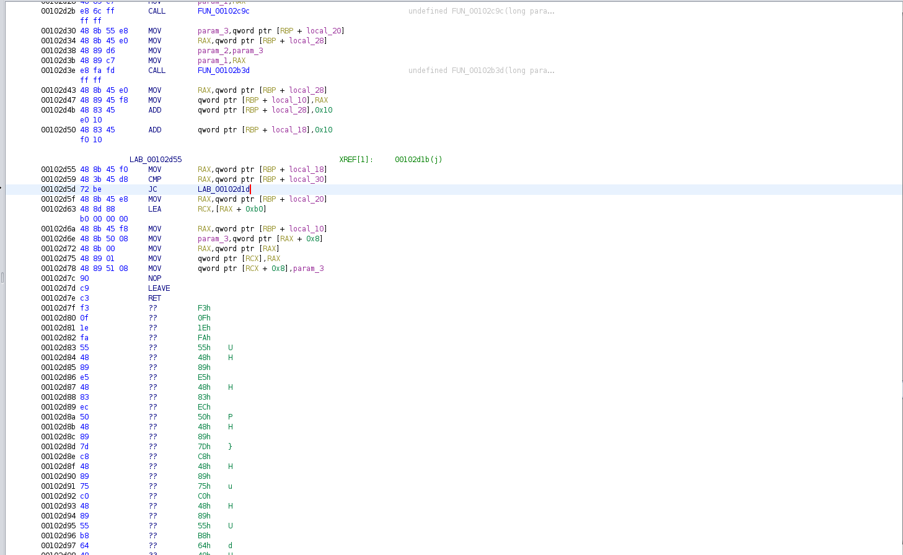

# Dummyper

This stupid program has encrypted our flag.
We only have a dump left.

Attachments:
* [dump](./dump)

## Solution

- We are given a `dump` file of size 36.6 MB which is very big for a ELF binary.

**File**
```
>>> file dump
dump: ELF 64-bit LSB pie executable, x86-64, version 1 (SYSV), dynamically linked, interpreter /lib64/ld-linux-x86-64.so.2, stripped
```

If we look into the hexdump of the binary there is about 30 MB data filled with null bytes.

### Initial Decompilation

Loaded the binary in Ghidra, Ghidra can't identify the functions, So I went to the entry address using the ELF header and decompiled it (press `D`) and made into a function (press `F`). By that we got the main function.

**Main Function**
```c
void main(undefined *param_1,undefined *param_2,undefined8 param_3,char param_4)

{
	FUN_00101691(param_1,param_2,param_3,param_4);
	FUN_0010172a();
	FUN_0010188b();
	return;
}
```

- `FUN_00101691` : Has some invalid opcode if we try to decompile it
- `FUN_0010172a` : We will come to it later
- `FUN_0010188b` : Is the most interesting to use right now

### FUN_0010188b (Dumping Function)

I renamed some variables and cleared some junk code
```c
void FUN_0010188b(void)

{
	char *pcVar1;
	long in_FS_OFFSET;
	char *line;
	size_t local_78;
	longlong memory_end_address;
	FILE *proc_maps_file;
	longlong memory_start_address;
	char *found_char_pos;
	size_t memory_size;
	FILE *mem_file;
	void *memory_to_dump;
	FILE *dump_file;
	char memory_mappings [12];
	undefined local_1e;
	char memory_end_string [13];

	proc_maps_file = fopen("/proc/self/maps","r");
	memory_start_address = 0;
	memory_end_address = 0;
	fread(memory_mappings,12,1,proc_maps_file);
	local_1e = 0;
	memory_start_address = strtoll(memory_mappings,0,16);
	line = 0;
	
	do {
		getline(&line,&local_78,proc_maps_file);
	} while (strstr(line,"[heap]"));
	
	found_char_pos = strchr(line,'-');
	if (found_char_pos) {
		strncpy(memory_end_string, ++found_char_pos, 12);
		memory_end_address = strtoll(memory_end_string,0,16);
	}
	
	memory_size = memory_end_address - memory_start_address;
	mem_file = fopen("/proc/self/mem","r");
	if (mem_file) {
		fseek(mem_file,memory_start_address,0);
		memory_to_dump = malloc(memory_size);
		fread(memory_to_dump,memory_size,1,mem_file);
		fclose(mem_file);
		dump_file = fopen("dump","w");
		fwrite(memory_to_dump,memory_size,1,dump_file);
		fclose(dump_file);
		if (local_10 == *(ulong *)(in_FS_OFFSET + 0x28)) {
			return;
		}
		__stack_chk_fail();
	}
	puts("NULL!");
	exit(1);
}
```

So this function produces the `dump` file at the end of execution of the other functions
- It reads the memory mappings of the binary from `/proc/self/maps`

**Sample File**
```
00400000-00452000 r-xp 00000000 08:02 173521      /usr/bin/dbus-daemon
00651000-00652000 r--p 00051000 08:02 173521      /usr/bin/dbus-daemon
00652000-00655000 rw-p 00052000 08:02 173521      /usr/bin/dbus-daemon
00e03000-00e24000 rw-p 00000000 00:00 0           [heap]
00e24000-011f7000 rw-p 00000000 00:00 0           [heap]
```

- It reads the 1st hex int i.e address where the binary is loaded and stores into a variable `memory_start_address`
- It loops until the last `[heap]` is found in the lines.
- Then it calculates the end address of the heap by getting the hex int after '-'.
- Then it calculates the total size to dump and allocates memory for the data.

- Then it reads the memory of the binary from `/proc/self/mem`
- Then it dumps the whole binary and the heap of the binary into the `dump` file.

So, we understood what the extra data appended to the end of the binary.

### FUN_0010172a (Encrypt Opcodes Function)

```c
void FUN_0010172a(void)
{
    int iVar1;
    uchar *key;
    void *__ptr;

    iVar1 = getpagesize();
    mprotect(FUN_001013a9 + -(0x1013a9U % (ulong)(long)iVar1),(long)iVar1,7);
    key = (uchar *)FUN_001013a9();
    fread(key,32,1,_DAT_00905060);      /* Get key */

    for (int i = 0; i < 64; ++i )       /* Garbage loop */
    {
        iVar1 = rand();
        __ptr = (void *)FUN_001013a9();
        fread(__ptr,(long)(iVar1 % 0x7ff),1,_DAT_00905060);
    }
    
    for (int i = 0; i < 896; ++i )      /* Encryption */
        FUN_001013a9[i] ^= key[i % 32];

    return;
}
```

- It uses mprotect to make some opcodes into `RWX`.
- It uses `FUN_001013a9` to initialize a unsigned char array `key` of size 32 bytes (Function explanation after patching opcodes)
- Then it reads the 32-byte key from somewhere (we can't see the source bcz it has changed while execution of the program)
- It uses the key to encrypt 896 opcode bytes by repeated xor.

### Patcher
- To get the original opcode we need to decrypt the encrypted data... and for that we need key.
- Since xor is reversible we can do a `known plaintext attack` to get some part of the key and find the full key in the heap dump.

**POC**
- We know the function prologue `[0xf3, 0x0f, 0x1e, 0xfa, 0x55, 0x48, 0x89, 0xe5]` which is a know plaintext.
- We know that there are atleast 2 functions in the huge opcode bytes and we know the offset.
- We xor the known part to get a 16 byte key. Then we search the part in the hexdump to get the 32 byte key.
- Then we patch the 896 bytes with the key we got.

**Ugly Patcher Script** (written with help of my teammate rey#7813)
[patcher.py](./patcher.py)

## Decompile Patched Binary
- We can now decompile all the functions now.

### FUN_001013a9 (Memset Function)
```c
void * memset_func(size_t size)
{
    void *__s;
    
    __s = (void *)(_start_ptr + base_addr);
    memset(__s,0xcc,size);
    _start_ptr = size + _start_ptr;
    return __s;
}
```
Ghidra isn't able to decompile properly bcz the data was changed during program execution. The program
- Allocates a data of size `size` after the address of `_start_ptr + base_addr` and fills it with `0xcc`
- Then returns a pointer to the start of the data section.

**Conclusion**
When this function is called it creates a memory section after the end of the previous of the block. We can get the data of any section if we know the offset and the size of the data from the `Heap Dump`.

### FUN_00101691 (flag_function)
```c
void flag_function(void)
{
    time_t tVar1;
    FILE *flag_stream;
    uchar *flag_data;
    
    _urandom = fopen("/dev/urandom","r");
    tVar1 = time((time_t *)0x0);
    srand((uint)tVar1);
    flag_stream = fopen("./flag.txt","r");
    flag_data = (uchar *)memset_func(128);
    fread(flag_data,128,1,flag_stream);
    fclose(flag_stream);
    stuff_with_flag_data(flag_data);
    return;
}
```

So we can see the `_DAT_00905060` from where key was read was actually `/dev/urandom`

- The function reads the flag and does some stuff on it.

### FUN_001013fe (stuff_with_flag_data)
```c
void stuff_with_flag_data(unsigned char *flag_data)
{
    unsigned char *rand_data_32;
    unsigned char *rand_data_16;
    unsigned char *memset_data;

    /* Garbage loop */
    rand_data_32 = (unsigned char *)memset_func(0x20);
    /* Garbage loop */
    rand_data_16 = (unsigned char *)memset_func(0x10);
    /* Garbage loop */
    fread(rand_data_32,1,32,_urandom);
    fread(rand_data_16,1,16,_urandom);
    memset_data = (unsigned char *)memset_func(192);
    /* Garbage loop */
    init_memset_data_1(memset_data,rand_data_32);
    init_memset_data_2(memset_data,rand_data_16);
    enc_flag(memset_data,flag_data,128);
    return;
}
```
- It does some initialisation of some data (memset_data) with random data which is ultimately used to encrypt the flag.
- It has some loops which fills the memory with garbage data

### FUN_00102ced (enc_flag)
```c
void enc_flag(unsigned char *memset_data,unsigned char *param_2, unsigned long size_128)
{
    unsigned char *flag_data;
    unsigned long counter;
    unsigned char *xor_data;
    
    xor_data = memset_data + 0xb0;
    counter = 0;
    flag_data = param_2;
    while (counter < size_128) {
        xor_data(flag_data,xor_data);
        some_enc_stuff(flag_data,memset_data);
        xor_data = flag_data;
        flag_data = flag_data + 0x10;
        counter = counter + 0x10;
    }
    *(unsigned char **)(memset_data + 0xb0) = *(unsigned char **)(xor_data + 0);
    *(unsigned char **)(memset_data + 0xb8) = *(unsigned char **)(xor_data + 8);
    return;
}
```
- It does some stuff to encode flag
- After the encryption loop the last 16 bytes of the `flag_data` is set as the last 16 bytes of `memset_data`

## Decryption of Flag
If we see below the assembly of the encoding flag function there is another function Ghidra didn't decompiled.

<p align="center"></p>

If we decompile it forcefully we get the decryption function. Thanks to the author ;)

```c
void dec_flag(unsigned char *memset_data, unsigned char *param_2, ulong size)
{
    unsigned char *enc_flag_data;
    int i;
    unsigned char *uVar2;
    unsigned char *uVar3;
    
    unsigned char tmp[16];

    i = 0;
    enc_flag_data = param_2;
    for (int i = 0; i <size; i += 16)
    {
        uVar2 = *(unsigned char **)(enc_flag_data + 8);
        uVar3 = *(unsigned char **)enc_flag_data;
        decrypt_stuff(enc_flag_data,memset_data);
        xor_data(enc_flag_data,memset_data + 0xb0);
        *(unsigned char **)(memset_data + 0xb0) = uVar3;
        *(unsigned char **)(memset_data + 0xb8) = uVar2;
        enc_flag_data = enc_flag_data + 0x10;
    }
    return;
}
```

### Get data to decrypt
We got the decryption function, now we need to find data. As the flag is the 1st data to use memset, we read 128 bytes from the base_offset and get the flag_data. Then use the last 16 bytes of the `enc_flag_data` to find the offset of `memset_data` and then read 192 bytes from there

[get_data.py](./get_data.py)

## Decrypt
- Wrote all the functions needed to decrypt in a C program with the data used stored as an array.
[decrypt.c](./decrypt.c)

Running it we get the flag.
```
Memset >>
0x38 0x88 0x2e 0xab 0xe1 0x0e 0xf8 0xfe 0xb8 0xd4 0x96 0x6f 0x20 0x16 0xb7 0xee 
0x7e 0x21 0x06 0x1c 0x9f 0x2f 0xfe 0xe2 0x27 0xfb 0x68 0x8d 0x07 0xed 0xdf 0x63 
0x29 0xbf 0xfd 0xd9 0xb6 0x90 0x03 0x3b 0x91 0x6b 0x6b 0xb6 0x96 0x86 0xb4 0xd5 
0x69 0x32 0xfe 0x49 0xdf 0xa2 0xfd 0x72 0x4e 0xc9 0x96 0xc4 0xd8 0x4f 0x22 0x11 
0xe5 0xa1 0x7c 0x28 0x3a 0x03 0x81 0x5a 0x74 0xca 0x17 0x9e 0xac 0x85 0x35 0x8f 
0x62 0x37 0x0f 0xb9 0x58 0x34 0x8e 0xe3 0x2c 0xfe 0x99 0x7d 0x80 0x7b 0xac 0xf2 
0x63 0xa6 0x86 0x74 0x3b 0x92 0x08 0x97 0x17 0x6c 0x91 0xea 0x97 0x17 0x3d 0x18 
0xd3 0x81 0x2b 0xfc 0xe8 0x13 0x23 0x6b 0xff 0x7f 0xb2 0x81 0x68 0x68 0x8f 0x99 
0x16 0xf2 0xc5 0xb9 0xfe 0xe1 0xe6 0xd2 0x01 0x9e 0x54 0x53 0x69 0xf6 0xdb 0xca 
0x4f 0x4b 0xb1 0x40 0xb1 0xaa 0x57 0x92 0xb0 0x34 0x03 0xc1 0xd9 0xc2 0xd8 0x0b 
0x5c 0x2a 0x9a 0x75 0xed 0x80 0xcd 0xe7 0x5d 0xb4 0xce 0x26 0x84 0x76 0x16 0x2d 
0x0a 0xce 0x22 0xb2 0x25 0xd7 0x0b 0xcb 0xd0 0xbe 0x79 0x68 0xdc 0xe4 0x2b 0xc8 
Flag Dump >>
0x19 0xf7 0x83 0xda 0xd8 0xad 0xec 0xe4 0xb4 0xa0 0x7a 0xfe 0xcf 0x7a 0xc3 0x07 
0x6a 0x75 0x73 0x74 0x20 0x75 0x6e 0x75 0x73 0x75 0x61 0x6c 0x2c 0x20 0x68 0x65 
0x72 0x65 0x27 0x73 0x20 0x79 0x6f 0x75 0x72 0x20 0x66 0x6c 0x61 0x67 0x3a 0x20 
0x41 0x65 0x72 0x6f 0x7b 0x64 0x33 0x37 0x66 0x64 0x36 0x64 0x62 0x32 0x66 0x38 
0x64 0x35 0x36 0x32 0x34 0x32 0x32 0x61 0x61 0x66 0x32 0x61 0x38 0x33 0x64 0x63 
0x36 0x32 0x30 0x34 0x33 0x7d 0xcc 0xcc 0xcc 0xcc 0xcc 0xcc 0xcc 0xcc 0xcc 0xcc 
0xcc 0xcc 0xcc 0xcc 0xcc 0xcc 0xcc 0xcc 0xcc 0xcc 0xcc 0xcc 0xcc 0xcc 0xcc 0xcc 
0xcc 0xcc 0xcc 0xcc 0xcc 0xcc 0xcc 0xcc 0xcc 0xcc 0xcc 0xcc 0xcc 0xcc 0xcc 0xcc 
|> >>>
zzjust unusual, here's your flag: Aero{d37fd6db2f8d562422aaf2a83dc62043}
```

## Flag
> Aero{d37fd6db2f8d562422aaf2a83dc62043}
