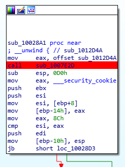
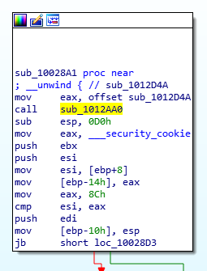
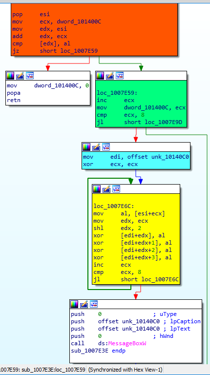
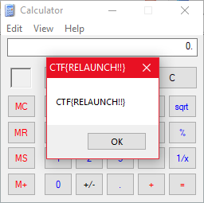

# Relaunch

Can you find the secret code to relaunch the missiles?

Attachments:
* [calc.exe](./calc.exe)

## Solution
- We are given a modified version of the calculator(calc.exe) of Windows 2003
- Searched Google about that verison and got hands on a [writeup](https://blog.skullsecurity.org/2019/in-bsidessf-ctf-calc-exe-exploits-you-author-writeup-of-launchcode) by author of a similar challenge in BsidesSF 2019
- Download the original calculator from that site and did binary diffing.

### Binary Diff
- I used `radiff2` for the binary diffing
**Result**
```bash
>>> radiff2 -A -C calc.exe calc-original.exe
# Some radare2 analysis here
                                                              fcn.010016d0   66 0x10016d0 |   MATCH  (1.000000) | 0x10016d0    66 fcn.010016d0
                                                              fcn.01001712   53 0x1001712 |   MATCH  (1.000000) | 0x1001712    53 fcn.01001712

# Some MATCHed Functions here 
                                                              fcn.01002828   71 0x1002828 |   MATCH  (1.000000) | 0x1002828    71 fcn.01002828
                                                              fcn.0100286f   50 0x100286f |   MATCH  (1.000000) | 0x100286f    50 fcn.0100286f
                                                              fcn.010028a1 7363 0x10028a1 | UNMATCH  (0.999592) | 0x10028a1  7363 fcn.010028a1
                                                              fcn.01004564   82 0x1004564 |   MATCH  (1.000000) | 0x1004564    82 fcn.01004564
                                                              fcn.010045d4   82 0x10045d4 |   MATCH  (1.000000) | 0x10045d4    82 fcn.010045d4
# Some MATCHed Functions here

                                                              fcn.01007d51   85 0x1007d51 |   MATCH  (1.000000) | 0x1007d51    85 fcn.01007d51
                                                              fcn.01007e2c    1 0x1007e2c |   MATCH  (0.006329) | 0x1007e2c   158 fcn.01007e2c
                                                              fcn.01007e2d  114 0x1007e2d |     NEW  (0.000000)
                                                              fcn.01007eca   93 0x1007eca |   MATCH  (1.000000) | 0x1007eca    93 fcn.01007eca
                                                              fcn.01007f27  153 0x1007f27 |   MATCH  (1.000000) | 0x1007f27   153 fcn.01007f27
# Some MATCHed Functions here
                                                              fcn.010127ce   77 0x10127ce |   MATCH  (1.000000) | 0x10127ce    77 fcn.010127ce
                                                              fcn.0101281b  138 0x101281b |   MATCH  (1.000000) | 0x101281b   138 fcn.0101281b
                                                                    entry0  489 0x10128a5 | UNMATCH  (0.964623) | 0x10128a5   489 entry0
                                                              fcn.01012aa0   31 0x1012aa0 |   MATCH  (1.000000) | 0x1012aa0    31 fcn.01012aa0
                                         sub.msvcrt.dll__CxxThrowException    6 0x1012ac0 |   MATCH  (1.000000) | 0x1012ac0     6 sub.msvcrt.dll__CxxThrowException
                                                              fcn.01012b20  149 0x1012b20 |   MATCH  (1.000000) | 0x1012b20   149 fcn.01012b20
                                                              fcn.01012bc0   52 0x1012bc0 |   MATCH  (1.000000) | 0x1012bc0    52 fcn.01012bc0
                                                sub.msvcrt.dll__XcptFilter    6 0x1012bf4 |   MATCH  (1.000000) | 0x1012bf4     6 sub.msvcrt.dll__XcptFilter
                                                  sub.msvcrt.dll__initterm    6 0x1012bfa |   MATCH  (1.000000) | 0x1012bfa     6 sub.msvcrt.dll__initterm
                                                              fcn.01012c00   18 0x1012c00 |   MATCH  (1.000000) | 0x1012c00    18 fcn.01012c00
                                                              fcn.01012c12    3 0x1012c12 |   MATCH  (1.000000) | 0x1012c12     3 fcn.01012c12
                                                              fcn.01012c18   59 0x1012c18 |   MATCH  (1.000000) | 0x1012c18    59 fcn.01012c18
                                                              fcn.01012c53   17 0x1012c53 |   MATCH  (1.000000) | 0x1012c53    17 fcn.01012c53
                        sub.msvcrt.dll_void___cdecl_operator_delete_void__    6 0x1012c6a |   MATCH  (1.000000) | 0x1012c6a     6 sub.msvcrt.dll_void___cdecl_operator_delete_void__
                                                              fcn.01012c70   47 0x1012c70 |   MATCH  (1.000000) | 0x1012c70    47 fcn.01012c70
                                                              fcn.01012cce   72 0x1012cce |   MATCH  (1.000000) | 0x1012cce    72 fcn.01012cce
                                                              fcn.01012d16   24 0x1012d16 |   MATCH  (1.000000) | 0x1012d16    24 fcn.01012d16
sub.msvcrt.dll_public_virtual:_void___thiscall_type_info::destructor_void_    6 0x1012d2e |   MATCH  (1.000000) | 0x1012d2e     6 sub.msvcrt.dll_public_virtual:_void___thiscall_type_info::destructor_void_
                                                 sub.msvcrt.dll__controlfp    6 0x1012d34 |   MATCH  (1.000000) | 0x1012d34     6 sub.msvcrt.dll__controlfp
                               sub.msvcrt.dll_void___cdecl_terminate_void_    6 0x1012d3a |   MATCH  (1.000000) | 0x1012d3a     6 sub.msvcrt.dll_void___cdecl_terminate_void_
```
- So there is `UNMATCH` in the `fcn.010028a1` and a new function `fcn.01007e2d`

### Function Analysis
- New v/s Original
<p align="center"></p>

- We can see there is a new function `sub_1007E2D` instead of the `sub_1012AA0`.
- Function `sub_1007E2D` just calls `sub_1007E3E`
- Since `sub_010028A1` checks the key presses of the user the function called must be the function that will give us the flag

### Flag Function (`sub_1007E3E`)
<p align="center"></p>

- So it checks key presses and if it matches the values of `[edx]`.
- If 8 keys are matched it decodes the flag by xoring something.

**Solution**

- I used IDA to set a breakpoint at the start of this function.
- Presses a key in the calculator
- Changed `eax` & `ecx` values to get execution into the decryption block (yellow shade) and continued.
<p align="center"></p>

## Flag
> CTF{RELAUNCH!!}
