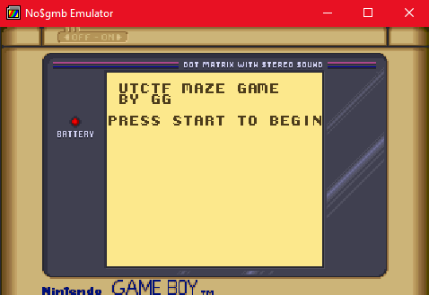
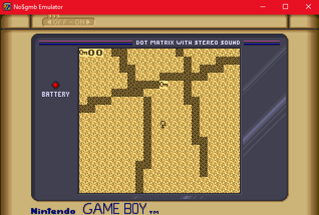
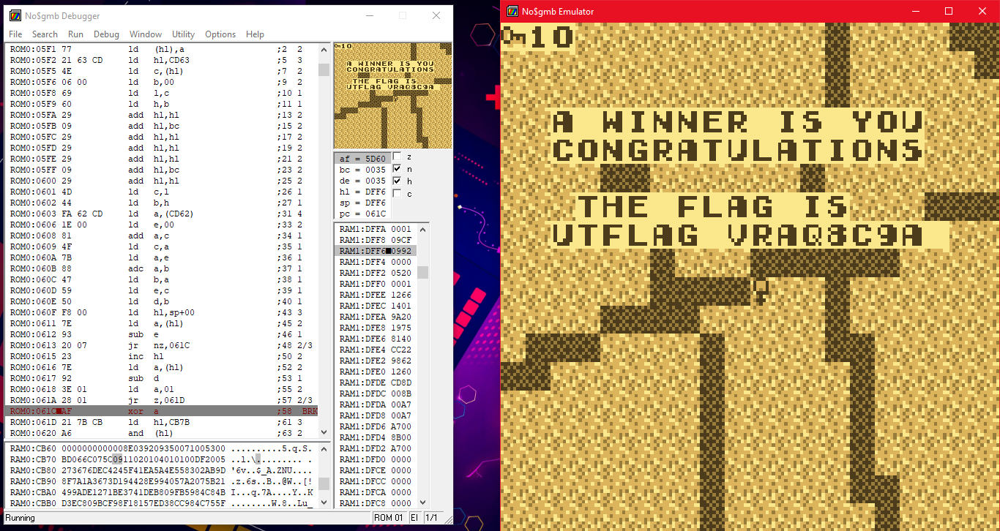

# UTCTF Adventure ROM Part 3

- The file is a Game Boy ROM and should run fine in most emulators.
- You do not need to modify the game to win and make it print the flag -- you just need to play the game "correctly"

Attachments:
* [maze.gb](./maze.gb)

## Solution

<p align="center"></p>

<p align="center"></p>

I used Ghidra with [GhidraBoy](https://github.com/Gekkio/GhidraBoy) plugin to load the binary. And for Dynamic Analysis I used [no$gmb](https://problemkaputt.de/gmb.htm)

### Main Function
Got main function from analysis of `entry`.
```c
void main(void)
{
  undefined2 uVar1;
  char extraout_E;
  char cVar2;
  byte extraout_E_00;
  
  uVar1 = FUN_1170(" \n UTCTF MAZE GAME\n BY GG\n\nPRESS START TO BEGIN");
  cVar2 = extraout_E;
  do {
    read_key();
  } while (-1 < cVar2);
  init_something(uVar1);
  do {
    print_on_screen();
    read_input(extraout_E_00);
    idk_what();
  } while( true );
}
```

### `print_on_screen` function
```c

void print_on_screen(void)
{
  // Variables

  if (check_data == 0) {
    // Print the maze/keys/etc
  }
  else {
    if (check_flag == 0) {
      print((byte *)"YOU LOST",5,3);
      print((byte *)"OOPS",7,4);
      print((byte *)"SORRY",6,5);
      print((byte *)"LMOA",7,6);
    }
    else {
      print((byte *)"A WINNER IS YOU",2,3);
      print((byte *)"CONGRATULATIONS",2,4);
      print((byte *)"THE FLAG IS",3,6);
      print((byte *)"UTFLAG ",2,7);
      // Decrypt Flag Data
      DAT_cd58 = 0;
      do {
        *(byte *)CONCAT11((0xa6 < DAT_cd58) + -0x33,DAT_cd58 + 0x59) =
             *(byte *)CONCAT11((0x2a < DAT_cd58) + -0x35,DAT_cd58 - 0x2b) ^
             *(byte *)CONCAT11((0x32 < DAT_cd58) + -0x35,DAT_cd58 - 0x33);
        DAT_cd58 = DAT_cd58 + 1;
      } while (DAT_cd58 < 8);
      DAT_cd61 = 0;
      print(&DAT_cd59,9,7);
      print((byte *)" ",0x11,7);
    }
  }
  return;
}
```
So it prints the maze till `check_data` is 0, if it's not then it will check `check_flag` then will print flag if it's ture.

### `read_input` function
```c
void read_input(byte param_1)
{
  read_key();
  DAT_cd68 = param_1;
  if ((param_1 & 2) != 0) {
    parse_input(-1,0);  /*Left key*/
  }
  if ((DAT_cd68 & 1) != 0) {
    parse_input(1,0);   /*Right key*/
  }
  if ((DAT_cd68 & 8) != 0) {
    parse_input(0,1);   /*Up key*/
  }
  if ((DAT_cd68 & 4) == 0) {
    parse_input(0,-1);  /*Down key*/
  }
  return;
}
```

### `parse_input` function
To cleanly understand this function I used dynamic analysis to clear the messy code given by ghidra.
```c
void parse_input(char x,char y)
{
	byte chk;
	short tmp;
	
	if (check_data == 0)
	{
		new_x = pos_x + x;
		new_y = pox_y + y;
		if ((new_x < 50) && (new_y < 50))
		{
			tmp = new_y * 50 + new_x;
			map_value = map_data[tmp];
			if (map_value != 1) // 1 is wall, 0 is open area
			{
				pos_x = new_x;
				pox_y = new_y;
				if (map_value == 2) // 2 is key
				{
					tmp = new_y * 50 + new_x;
					if (tmp != check_pos[no_of_flag]) // Done with 2 8-bit registers
					{
						chk = 0;
					}
					check_flag = chk & check_flag;
					// 2 Functions (Not needed for our analysis)
					no_of_flag = no_of_flag + 1;
					if (no_of_flag == 10)
					{
						print_on_screen();
						check_data = 1;
					}
				}
			}
		}
	}
}
```
**Solution**

While dynamic analysis I extracted those flag positions. Wrote a [script](./map_pos.py) to give the required order of getting flags.
```
[10, 32]
[0, 1]
[3, 49]
[13, 48]
[33, 49]
[25, 16]
[0, 12]
[46, 3]
[29, 40]
[25, 30]
```
So I plotted that in [Desmos](https://www.desmos.com/calculator) to get a visual representation, then hit the keys in this order and got the flag.

<p align="center"></p>

## Flag
> utflag{vraq8c9a}
