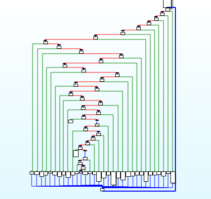

# Infected

Can you break my tiny little box?

Attachments:
* [layers](./layers)

## Solution
The binary is LLVM obfuscated... IDA decompilation shows it like this...
```c
                         while ( 1 )
                          {
                            while ( i == 0xA57D3848 )
                            {
                              /// Code
                            }
                            if ( i != 0xA5AA2438 )
                              break;
                            ++b;
                            i = 0x39ABA8E6;
                          }
                          if ( i != 0xBD3CC7E5 )
                            break;
                          c = 0;
                          i = 0xF100B3F1;
                        }
                        if ( i != 0xC69A2A67 )
                          break;
                        v4 = 0x6968BCED;
                        if ( a < 32 )
                          v4 = 0xBD3CC7E5;
                        i = v4;
                      }
                      if ( i != 0xCF365A10 )
                        break;
                      i = 0x120F462B;
                    }
                    if ( i != 0xF100B3F1 )
```

<p align="center"></p>

Basically it's a like a jump table, it is comparing to a value, if equal jumps to a offset, easier to read in disassembly...
```
   0x401492:    mov    eax,DWORD PTR [rbp-0x35c]
   0x401498:    sub    eax,0x140af898
   0x40149d:    mov    DWORD PTR [rbp-0x3b8],eax
   0x4014a3:    je     0x401ba5
   0x4014a9:    jmp    0x4014ae
   0x4014ae:    mov    eax,DWORD PTR [rbp-0x35c]
   0x4014b4:    sub    eax,0x15223c70
   0x4014b9:    mov    DWORD PTR [rbp-0x3bc],eax
   0x4014bf:    je     0x401d6b
   0x4014c5:    jmp    0x4014ca
   0x4014ca:    mov    eax,DWORD PTR [rbp-0x35c]
   0x4014d0:    sub    eax,0x263f9e70
   0x4014d5:    mov    DWORD PTR [rbp-0x3c0],eax
   0x4014db:    je     0x4019e7
   0x4014e1:    jmp    0x4014e6
   0x4014e6:    mov    eax,DWORD PTR [rbp-0x35c]
   0x4014ec:    sub    eax,0x28b41c13
   0x4014f1:    mov    DWORD PTR [rbp-0x3c4],eax
   0x4014f7:    je     0x4017c4
   0x4014fd:    jmp    0x401502
```

To parse it I used a gdb script to break at the offsets of `je` and print the `rbp-0x35c`. The output gives a flow of the program. Then I used a python parser to parse the  `rbp-0x35c` values to the IDA decompilation (regex FTW). Clearing the loops and the obfuscations, we get

```c
	seed = sub_400E40(flag);
	srand(seed);

	for(int j =0; j < 32; j++)
		v33[j] = rand();
			
	ptr = malloc(32);
	v27 = 16 - (strlen(flag) & 0xF);

	for(int v26; v26 < v27; v26++)
		sprintf(flag, "%s%c", flag, v27)

	for(int v25 = 0; v25 < strlen(flag) / 16; v25++)
	{
		memset(ptr, 0, 0x20uLL);
		sub_403EC0(&flag[16 * v25], v33, ptr, 0x20u);

		for(int v24 = 0; v24 < 0x10; v24++)
			v32[16 * v25 + v24] = ptr[v24];
	}

	memset(v23, 0, 0x09);
	memset(v22, 0, 0x11);
	memset(v21, 0, 0xC8);

	for(int v20 = 0; v20 < 0x10; v20++)
		v22[v20] = rand();
			
	for(int v19 = 0; v19 < strlen(v32) / 8; v19++)
	{
		memset(v23, 0, 0x08);
		__isoc99_sscanf(&v32[8 * v19], "%8s", v23);
		sub_4008F0(v23, v22);
		sprintf(v21, "%s%s", v21, v23);
	}

	// Check v21 with byte_606090
  for(k = 0; k < 48; k++)
		dword_6060C4 |= byte_606090[k] ^ v21[k];
```

There are 3 functions called, I used the technique above to understood the code flow. Full decompiled script [here](./encrypt.c)

Parser and gdb scripts [here](./Analysis)

### Decryption

 - The sum of chars of the flag is used as seed of srand
 - 32 byte key is generated by rand (key1)
 - Flag is padded to multiple of 16 bytes
 - 16 blocks of flag are encrypted (Serpent Cipher)
 - 16 byte key is generated by rand (key2)
 - 8 blocks of serpent encrypted is again ecnrypted (TEA Encryption)
 - The result is compared with hardcoded values.

So we bruteforce the seed and decrypt, script [here](./Solve/decrypt.c)

## Flag
>  `flag{_a1f040be800d4dd9a2b9a7d2b8f2be31_}`