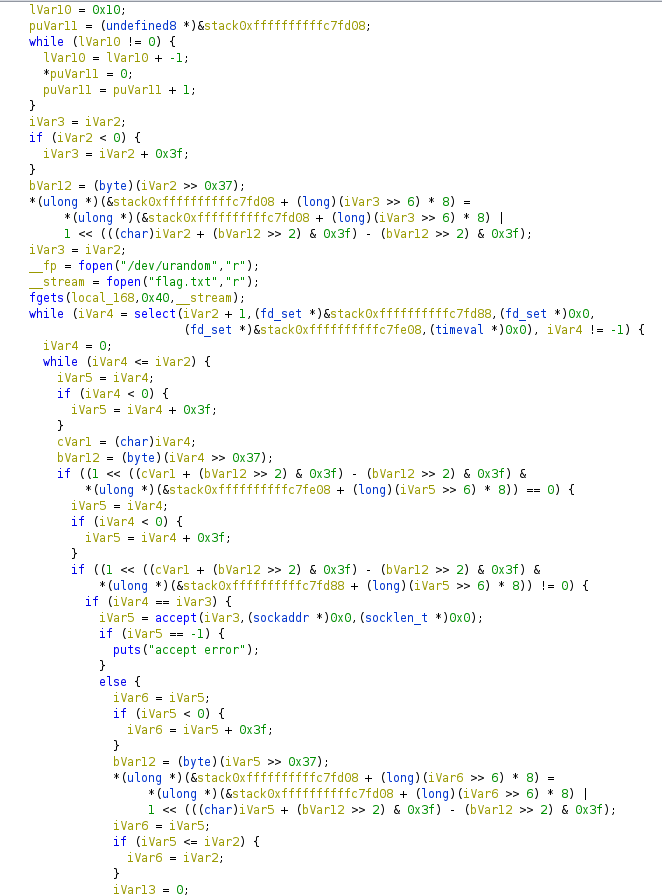

# Flag Submission Server

I made a new proprietary server to submit flags to! It uses my new proprietary extremely straightforward protocol. There's no client yet, but I figured I would test it in this CTF anyway. Connect to `rev.2021.chall.actf.co` on... you can figure out the port.

Attachments:
* [fss](./fss)

## Solution
We are given a server binary. This is an easy challenge but it has very less solves because IDA can't decompile it (stack frame is too big error). So I relied on the ugly code given by Ghidra and cleared it with help of IDA graph view.

<p align="center"></p>

### Main Function
The rough program is like...
```c
void main(int argc, char const *argv[])
{
  unsigned char rand_send[0xD];
  /* code */
  unsigned char data[] = {0xde, 0xad, 0xbe, 0xef, 0xfe, 0xed, 0xca, 0xfe, 0x13, 0x37, 0xab, 0xcd, 0xef};
  /* code */
  memset(&hints, 0, sizeof(hints));

  int s = getaddrinfo(NULL, "21450", &hints, &result);
  if (s != 0) {
    puts("getaddrinfo error");
    exit(1);
  }

  sfd = socket(result->ai_family, result->ai_socktype, result->ai_protocol);
  s = setsockopt(sfd, 1, 2, 1, 4);
  if (s != 0) {
    puts("setsockopt error");
    exit(1);
  }

  s = bind(sfd,result->ai_addr,result->ai_addrlen);
  if (s != 0) {
    puts("bind error");
    exit(1);
  }

  s = listen(sfd,0x10)
  if (s == 0) {
    puts("listen error");
    exit(1);
  }
  /* code */

  FILE *rand_stream = fopen("/dev/urandom","r");
  FILE *flag_stream = fopen("flag.txt","r");
  char flag [64];
  fgets(flag,0x40,flag_stream);

  fd_set read_fds;
  fd_set except_fds;

  while (1) {
    /* code initializing fd sets*/
    int FD_SETSIZE = sfd+1
    s = select(int FD_SETSIZE, readfds, NULL, except_fds, NULL);
    if (s == -1) {
      puts("select error");
      exit(1);
    }

    for(int i=0; i < FD_SETSIZE; i++)
    {
      if(!FD_ISSET (i, &except_fds)) // Probable
      {
        if(FD_ISSET (i, &readfds)) // Probable
        {
          if (i == sock)
          {
            s = accept(sfd, (sockaddr *)0x0, (socklen_t *)0x0);
            if (s == -1) {
              puts("accept error");
            }
            else
            {
              /* code */
              for(int j=0; j < 0xD; j++)
              {
                unsigned char tmp = _IO_getc((_IO_FILE *)rand_stream);
                tmp ^= data[j];
                rand_send[i] = tmp;
                send(sfd, tmp, 1, 0);
              }
              int inp_count = 0;
              int flag_count = 0;
              long check_number = 0x13371337;
            }
          }
          else
          {
            unsigned char buffer [264];
            s = recv(sfd, buffer, 0x100, 0);
            if (s == -1) {
              strerror(__errno_location());
              printf("recv error %s\n");
              /* code */
            }
            else if (s == 0)
            {
              /* code */
            }
            else
            {
              unsigned char inp_data[22];
              for(int x=0; x < s; x++)
              {
                inp_data[inp_count++] = buffer[x];
                if(inp_count==22)
                {
                  int check = 1;
                  for(int k=0; k < 0xD; k++)
                  {
                    if(inp_data[i+9] != rand_send[i])
                      check = 0;
                  }
                  long long tmp = rand_func(check_number);
                  if(*(long *)inp_data != tmp)
                    check = 0;

                  if(inp_data[8] == flag[flag_count])
                  {
                    if(check == 0)
                    {
                      close(sfd);
                      /* code */
                    }
                    flag_count++;
                    inp_count = 0;
                    check_number = 0;
                    send(sfd, "%", 1, 0);
                    for(int k=0; k < 0xD; k++)
                    {
                      int tmp = rand() & 0xFF;
                      send(sfd, tmp, 1, 0);
                      check_number = (check_number << 8) + tmp
                    }
                  }
                  else
                  {
                    send(sfd, "\r", 1, 0);
                  }
                }
              }
            }
          }
        }
      }
      else{
        /* code */
      }
    }
  }
}
```

### rand_func
```c
long long func(long long a1)
{
	srand(a1 ^ 0xBC614E);
	int sum = 0;
	for (int i = 0; i <= 7; ++i )
		sum = rand() % 10 + 10 * sum;
	return a1 * sum;
}
```

So the program:
- It gives 0xD bytes of xored rand data to connecting.
- Then it receives some data in the order `[8 bytes of check_data from rand_func][1 byte of flag][0xD bytes of rand]`

If the flag byte and the checks are correct then it returns `%` and the 4 bytes needed for new `check_number` else it returns `\r`. So we can bruteforce the flag bytes. We just need to take care of the checks, the 1st check needs to be calculated every time.

Solve script [here](./solve.py)

## Flag
> actf{M0R3_CH3CKSUMS!!!}