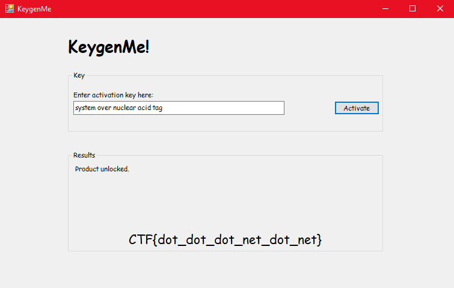

# Keygenme

Many of us got started in reversing by doing keygens. I thought I'd throw something together to introduce keygens and maybe take some of us back in time. Enjoy the theme.

Attachments:
* [keygenme.exe](./keygenme.exe)

## Solution
- Running `file` says .NET binary.
```
$ file keygenme.exe
keygenme.exe: PE32 executable (GUI) Intel 80386 Mono/.Net assembly, for MS Windows
```
- Used dnSpy-32 to analyze and debug the binary
- It has 5 functions other that main `Program`
```
Crypter
KeyCheck
KeygenForm
keywords
Wordlist
```
**main**

```c#
using System;
using System.Windows.Forms;

namespace keygenme
{
	internal static class Program
	{
		private static void Main()
		{
			Application.EnableVisualStyles();
			Application.SetCompatibleTextRenderingDefault(false);
			Application.Run(new KeygenForm());
		}
	}
}
```
- It just calls KeygenForm

### Keygen Form
- The keygen function initializes the GUI and does key check on button click
```c#
private void activate_btn_Click(object sender, EventArgs e)
{
	KeyCheck keyCheck = new KeyCheck(this.key_input.Text);
	this.resultsBox.Visible = true;
	this.flag_label.Visible = false;
	if (!keyCheck.Success)
	{
		this.results_text.Text = string.Format("Failed: {0}", keyCheck.Error);
		return;
	}
	Crypter crypter = new Crypter(keyCheck.KeyBytes);
	if (!crypter.checkKeyId(KeygenForm.keyId))
	{
		this.results_text.Text = string.Format("Invalid KeyID for this build.", new object[0]);
		return;
	}
	string text = crypter.decryptHexString(this.secret_text.Text);
	this.flag_label.Text = text;
	this.flag_label.Visible = true;
	this.results_text.Text = "Product unlocked.";
}
```
- `KeyCheck` function 1st checks the key

### KeyCheck
```c#
using System;
namespace keygenme
{
	internal class KeyCheck
	{
		public KeyCheck(string keyStr)
		{
			this.keyStr = keyStr.Trim();
			if (this.keyStr.Length > 0)
			{
				string[] array = this.keyStr.Split(new char[0]);
				this.keywords = new string[array.Length];
				for (int i = 0; i < array.Length; i++)
				{
					this.keywords[i] = array[i].ToLowerInvariant();
				}
			}
		}

		private int[] wordsToInts(string[] words)
		{
			Wordlist instance = Wordlist.Instance;
			int[] array = new int[words.Length];
			int[] array2 = new int[]
			{
				1,
				3,
				11,
				5,
				1
			};
			int num = 85;
			for (int i = 0; i < words.Length; i++)
			{
				int num2 = instance.wordIndex(words[i]);
				if (num2 == -1)
				{
					this.err = string.Format("{0} is not in the dictionary.", words[i]);
					return null;
				}
				array[i] = num2;
				if (i > 0 && num2 % i != 0 && i < words.Length - 1)
				{
					this.err = string.Format("{0} is not indexed correctly.", words[i]);
					return null;
				}
				if (i > 0 && num2 % array2[i] != 0 && i < words.Length - 1)
				{
					this.err = string.Format("{0} is not indexed correctly!", words[i]);
					return null;
				}
				num ^= num2;
			}
			if (num != 0)
			{
				this.err = "Check word does not match.";
				return null;
			}
			return array;
		}

		private bool dupeCheck()
		{
			for (int i = 0; i < this.keywords.Length; i++)
			{
				for (int j = 0; j < this.keywords.Length; j++)
				{
					if (i != j && this.keywords[i] == this.keywords[j])
					{
						return false;
					}
				}
			}
			return true;
		}

		private bool runCheck()
		{
			if (this.resChecked)
			{
				return this.success;
			}
			this.resChecked = true;
			if (this.keywords == null)
			{
				this.err = "No key provided.";
				return false;
			}
			if (this.keywords[0] != KeyCheck.keyIdentifier)
			{
				this.err = "Wrong key identifier.";
				return false;
			}
			if (this.keywords.Length != KeyCheck.strength)
			{
				this.err = "Incorrect key strength.";
				return false;
			}
			if (!this.dupeCheck())
			{
				this.err = "Duplicate key pieces.";
				return false;
			}
			int[] array = this.wordsToInts(this.keywords);
			if (array == null)
			{
				return false;
			}
			this.keyBytes = new byte[array.Length * 4];
			for (int i = 0; i < array.Length; i++)
			{
				BitConverter.GetBytes(array[i]).CopyTo(this.keyBytes, i * 4);
			}
			this.success = true;
			return this.success;
		}
		// Some variables
		private static readonly string keyIdentifier = "system";
		private static readonly int strength = 5;
	}
}
```
- It splits the words from the input.
- `KeyCheck` function checks the words(key)

**Check**

- The 1st word must be `system`
- There must be 5 words
- There should be no duplicate words
- Then it checks the words by using indexing of the words from a wordlist
- If the check passes it returns the indexes of the words as an array.

**KeygenForm**

If the keycheck is passed it checks a buildID and the key array stuff with Crypter

### Crypter
```c#
public Crypter(byte[] rawkey)
{
	SHA256 sha = SHA256.Create();
	this.keyBytes = sha.ComputeHash(rawkey);
}
public string getKeyID()
{
	byte[] array = SHA256.Create().ComputeHash(this.keyBytes);
	StringBuilder stringBuilder = new StringBuilder();
	for (int i = 0; i < array.Length; i++)
	{
		stringBuilder.Append(array[i].ToString("x2"));
	}
	return stringBuilder.ToString();
}
public bool checkKeyId(string keyid)
{
	return this.getKeyID() == keyid;
}
```
- The constructor initializes `keyBytes` with SHA-256 of the `keyBytes` which is the array of key positions.
- Then it checks if the BuildID(keyid) is equal to the SHA-256 hash of keyBytes.

**Solution**

Wrote a bruteforcer which checks every possible `num2`(index of the words) that can be used as key and checked the hashes to get the Key
[key_cracker.c](./key_cracker.c).

Then used the key pos to get the words. [script](keygen.py)
```
$ ./keygen
...
Checking Possible Key: 0x06e6, 0x04ef, 0x04ba, 0x000f, 0x06e9, 
Key Found!!!!

$ python keygen.py
system over nuclear acid tag 

```
Giving this key gives the flag.
<p align="center"></p>

## Flag
> CTF{dot_dot_dot_net_dot_net}
