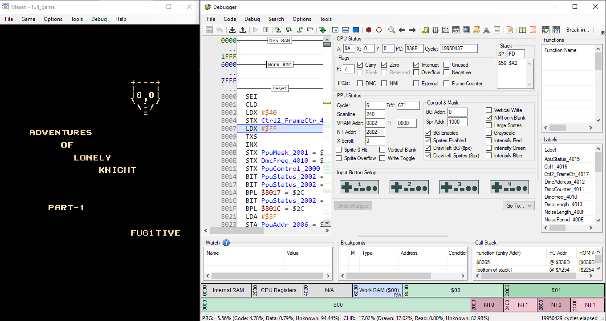
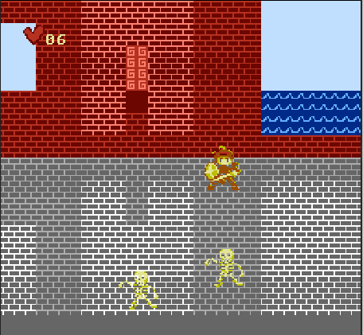
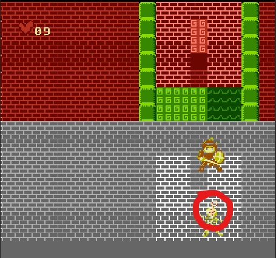
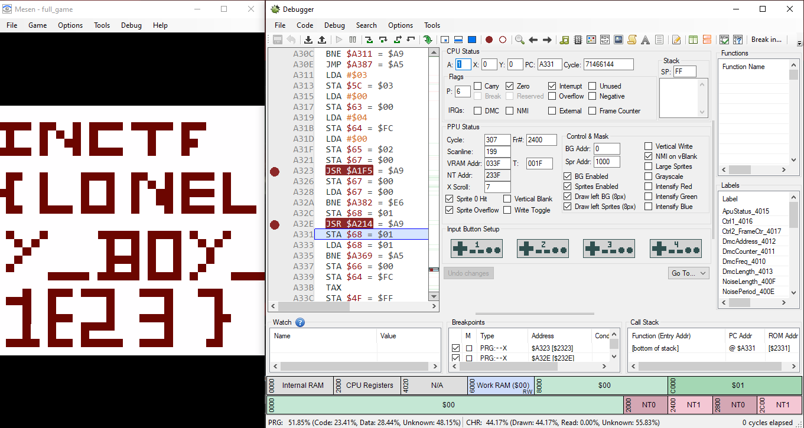

# Adventures of Lonely Knight (PART-1)

A lonely adventure of loney knight fighting mobs,there might be a sceret in the end.

Attachments:
* [full_game.nes](./full_game.nes)

## Solution
For this iNES reversing I used Ghidra with [NES Loader](https://github.com/kylewlacy/GhidraNes) and emulated/debugged with [Mesen](https://www.mesen.ca/)

<p align="center"></p>

<p align="center"></p>

### Game Analysis
The code in `reset` function is quite big. I am keeping the rough structure here. From address `0xa2bb`

```c
  do {
    while (mode == '\0') {
                    /* Loading Screen */
      if ((inp & 0x10) != 0) {
                    /* Start main game on `W` */
      }
    }
    while (mode == '\x01') {
                    /* Main Game Loop */
      if ((inp & 0x10) != 0) {
                    /* Pause/Resume */
        break;
      }
      if (DAT_0063 == '\0') {
        if (DAT_0066 != 0) {
                    /* Exit */
        }
      }
      else {
        mode = '\x03';
        DAT_0063 = '\0';
        DAT_0064 = 4;
        DAT_0065 = 0;
        DAT_0067 = 0;
        *(undefined2 *)(sVar6 + -1) = 0xa326;
        DAT_0067 = FUN_a1f5();
        if (DAT_0067 == '\0') {
          DAT_0068 = DAT_0067;
          *(undefined2 *)(sVar6 + -1) = 0xa331;
          DAT_0068 = FUN_a214();
          if (DAT_0068 == 0) {
                    /* End */
          }
          if (game_level == 3) {
            game_level = 4;
            DAT_0301 = '\x01';
          }
          else {
            game_level = 3;
          }
        }
        else {
          game_level = game_level + 1;
        }
      }
    }
    while (mode == '\x03') {
                    /* Update Level */
    }
    while (mode == '\x02') {
                    /* Pause Mode */
    }
    while (mode == '\x04') {
                    /* The end of the game, I guess wou won? Lives: xx */
    }
    while (mode == '\x05') {
                    /* Game End */
    }
  } while( true );
```

So our game updates level on the result of 2 functions:
- `FUN_a1f5` called at `0xa323`
- `FUN_a214` called at `0xa32e`

So if first time `FUN_a1f5` returns 0 and `FUN_a214` returns 1, we directly go to game level 3. Next time we get to game level 4 and get flag. These functions are triggered when we get a `key` / or end of level.

<p align="center"></p>

<p align="center"></p>


## Flag
> INCTF{LONELY_BOY_1E23}