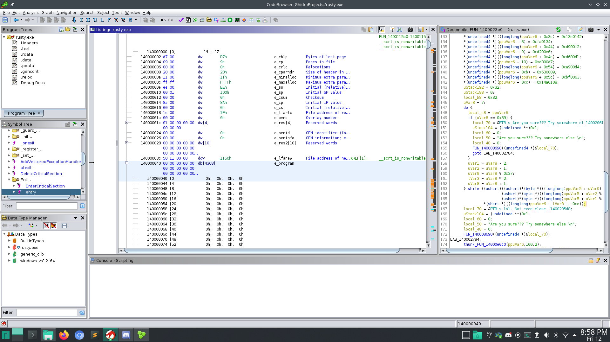
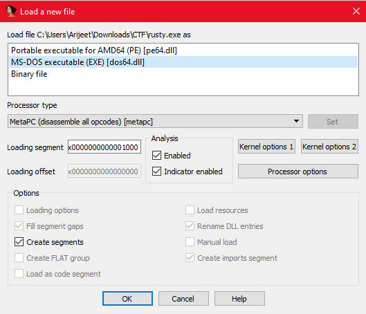
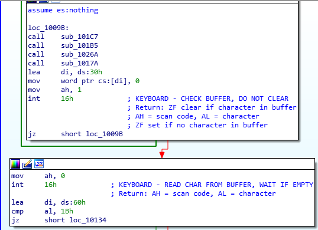
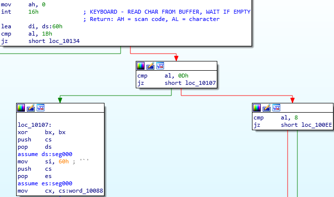
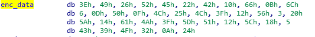

# Rusty 
Looking at Rust code in disassembler/decompiler hurts, so... look somewhere else.

Attachments:
* [rusty.exe](./rusty.exe)

## Solution
I was unable to solve this during the CTF. This `exe` has 2 code segments.
- A x86 part where there is Rust Code which is actually a rabbit hole.
- A DOS Stub part where the main challenge is located.
### Rust
Running the program in CMD we get -->
```
C:\Users\Arijeet\Downloads\CTF>rusty.exe
Give me the flag:
justCTF{test_flag}
lol. That's not even close.
```
We get the main function by checking the strings. It does some checks on our input string.
```c
if ((*(char *)local_c8 == 'j') &&
	(*(char *)((longlong)local_c8 + 1) == 'c') &&
	(*(char *)((longlong)local_c8 + 2) == 't') &&
	(*(char *)((longlong)local_c8 + 3) == 'f') &&
	(*(char *)((longlong)local_c8 + 4) == '{') &&
	(*(char *)((longlong)local_c8 + 0x36) == '}'))
	{
```
Then it checks every char of our flag on a looping algo
```c
      do {
        local_c8 = ppuVar6;
        if (uVar8 == 0x39) {
          local_70 = &PTR_s_Are_you_sure???_Try_somewhere_el_140020610;
          uStack104 = (undefined **)0x1;
          local_60 = 0;
          local_50 = "Are you sure??? Try somewhere else.\n";
          local_48 = 0;
          FUN_140008690((undefined4 *)&local_70);
          goto LAB_140002784;
        }
        uVar1 = uVar8 - 2;
        uVar2 = uVar8 - 1;
        uVar9 = uVar8 % 0x37;
        lVar3 = uVar8 * 2;
        uVar8 = uVar8 + 1;
      } while ((ushort)((ushort)*(byte *)((longlong)ppuVar5 + uVar9) +
                       (ushort)*(byte *)((longlong)ppuVar5 + uVar2 % 0x37) +
                       (ushort)*(byte *)((longlong)ppuVar5 + uVar1 % 0x37)) ==
               *(short *)((longlong)ppuVar6 + lVar3 + -0xe));
```

We get the values of the `ppuVar6` by using IDA debugging. Then we write a [solver script](./solver.py) in `z3`.

We get this `jctf{this_IS_not_the_|>_you_are_looking_4_FAKEFLAG!!!!}` as the output.
Using this is the binary gives this.

```
C:\Users\Arijeet\Downloads\CTF>rusty.exe
Give me the flag:
jctf{this_IS_not_the_|>_you_are_looking_4_FAKEFLAG!!!!}
Are you sure??? Try somewhere else.
```
So this gives a fake flag.

### DOS

In Ghidra we can see a very long(4368 bytes) DOS Stub.
<p align="center"></p>

So I ran the program in Dosbox.
<p align="center"></p>

Loaded the binary in IDA
<p align="center"></p>

IDA gives us a disassm... We can the see the program reads keyboard input with the BIOS Interrupt Call `int 16h`
<p align="center"></p>

The keys that are checked:
- `Esc` Key (0x1b)        : Exits the program
- `Enter` Key (0xd)       : Jumps to validation of flag function (Educated Guess)
- `Backspace` Key (0x8)   : Probably removes the last character (Educated Guess)
<p align="center"></p>

The validation part:
<p align="center"></p>

Some xor operations with some encrypted data is going on.
Encrypted Data:
<p align="center"></p>

The input(to get flag) length is 0x27
```
mov     cx, cs:word_10088 ; 0x27
sub     cx, bx
```

Which roughly translates to:
```python
enc = [0x3E, 0x49, 0x26, 0x52, 0x45, 0x22, 0x42, 0x10, 0x66, 0x0B, 0x6C, 0x6, 0x0D, 0x50, 0x0F, 0x4C, 0x25, 0x4C, 0x3F, 0x12, 0x56, 0x3, 0x20, 0x5A, 0x14, 0x61, 0x4A, 0x3F, 0x5D, 0x51, 0x12, 0x5C, 0x18, 0x5, 0x43, 0x39, 0x4F, 0x32, 0x0A, 0x24]

inp = "" # Something to get flag

for i in range(0x27):
  for j in range(i+1):
    enc[i] = ord(inp[j]) ^ enc[i]
```

This new enc probably be the flag. We know the flag it starts with `justCTF{`. So, we can get the 1st 8 chars of the input.

```python
enc = [0x3E, 0x49, 0x26, 0x52, 0x45, 0x22, 0x42, 0x10, 0x66, 0x0B, 0x6C, 0x6, 0x0D, 0x50, 0x0F, 0x4C, 0x25, 0x4C, 0x3F, 0x12, 0x56, 0x3, 0x20, 0x5A, 0x14, 0x61, 0x4A, 0x3F, 0x5D, 0x51, 0x12, 0x5C, 0x18, 0x5, 0x43, 0x39, 0x4F, 0x32, 0x0A, 0x24]

inp = "justCTF{"
flag = [0] * len(inp)

for i in range(len(inp)):
  flag[i] = ord(inp[i]) ^ enc[i]
  for j in range(i):
    flag[i] = flag[j] ^ flag[i]

print("".join([chr(c) for c in flag]))
```

Which returns `This pro`

Educated Guess: Input --> `This program cannot be run in DOS mode.` which has length 0x27.

Giving those in the DOSBOX we get the flag.
<p align="center"></p>

## Flag
> justCTF{just_a_rusty_old_DOS_stub_task}
