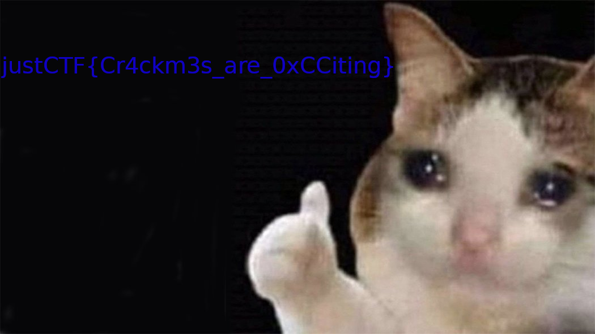

# debug_me_if_you_can 
> I bet you can't crack this binary protected with my custom bl33d1ng edg3 pr0t3c70r!!!111oneoneone

Attachments:
* [flag.png.enc](./flag.png.enc)
* [crackme.enc](./crackme.enc)
* [supervisor](./supervisor)

## Solution

We are given 2 binaries.
- crackme.enc : This is the main program which we need to crack but it has incomplete/encrypted code segment
- supervisor : This is the driver program which decrypts the code segments of crackme and runs it.

So it's a [nanomites](https://malwareandstuff.com/nanomites-on-linux/) type challenge.

### Analysis of supervisor
```c
signed __int64 __fastcall main(__int64 a1, char **a2, char **a3)
{
  signed int v4; // [rsp+1Ch] [rbp-4h]

  sub_11A5(a1, a2, a3);
  v4 = fork();
  if ( v4 )
  {
    if ( v4 <= 0 )
      return 0xFFFFFFFFLL;
    sub_1E99(v4);
  }
  else
  {
    sub_227F("./crackme.enc");
  }
  return 0LL;
}
```
The function `sub_11A5` initializes some data. Then it creates a child process with `fork()`.
Then it checks if the process is traced by `ptrace(PTRACE_TRACEME,0,0,0)`. If ptrace isn't used then it executes ***crackme.enc*** with `execl`
`sub_1E99` does some encrypt/decrypt on the child process with `ptrace`.

```c
__int64 __fastcall sub_1E99(unsigned int a1)
{
  wait(0LL);
  ptrace(PTRACE_CONT, a1, 0LL, 0LL);
  wait(0LL);
  while ( 1 )
  {
    while ( 1 )
    {
      v19 = sub_1AF1(a1);
      v18 = ptrace(PTRACE_PEEKTEXT, a1, v19, 0LL);
      if ( v18 != 0x1337BABE )
        break;
      v3 = a1;
      v17 = ptrace(PTRACE_PEEKTEXT, a1, v19 + 4, 0LL);
      v24 = 1;
      for ( i = 0; i <= 99; ++i )
      {
        if ( *((_DWORD *)&unk_50E0 + 8 * i) == v17 )
        {
          v3 = 32LL * i;
          v14 = *(_QWORD *)((char *)&unk_50E0 + v3);
          v15 = *(_QWORD *)((char *)&unk_50E0 + v3 + 8);
          v16 = *(_QWORD *)((char *)&unk_50E0 + v3 + 16);
          v6 = *(_QWORD *)((char *)&unk_50E0 + v3 + 24);
          v24 = 0;
          break;
        }
      }
      if ( v24 )
      {
        LODWORD(v14) = v17;
        v15 = v19 + 4;
        v16 = sub_1BA0(a1, v19, 0xFEEDC0DELL) + 4;
        v7 = sub_1BA0(a1, v19, 0xDEADC0DELL);
        v8 = dword_50CC++;
        v3 = 32LL * v8;
        *(_QWORD *)((char *)&unk_50E0 + v3) = v14;
        *(_QWORD *)((char *)&unk_50E0 + v3 + 8) = v19 + 4;
        *(_QWORD *)((char *)&unk_50E0 + v3 + 16) = v16;
        *(_QWORD *)((char *)&unk_50E0 + v3 + 24) = v7;
      }
      for ( j = 0; j <= 34; ++j )
      {
        if ( qword_5D60[5 * j] == v17 )
        {
          v9 = 5LL * j;
          sub_1C4B(
            a1,
            v3,
            v9 * 8,
            a1,
            v4,
            v5,
            qword_5D60[v9],
            qword_5D60[v9 + 1],
            qword_5D60[v9 + 2],
            qword_5D60[v9 + 3],
            qword_5D60[v9 + 4],
            v14,
            v15);
        }
      }
      sub_1B2E(a1, v16);
      ptrace(PTRACE_CONT, a1, 0LL, 0LL);
      wait(0LL);
    }
    if ( v18 != 0xDEADC0DE )
      break;
    for ( k = 0; k <= 99; ++k )
    {
      if ( v19 == qword_50F8[4 * k] )
      {
        for ( l = 0; l <= 34; ++l )
        {
          if ( qword_5D60[5 * l] == *((_DWORD *)&unk_50E0 + 8 * k) )
          {
            v10 = 32LL * k;
            v11 = *(_QWORD *)((char *)&unk_50E0 + v10 + 24);
            v12 = *(_QWORD *)((char *)&unk_50E0 + v10 + 16);
            sub_1D5C(
              a1,
              (signed int *)&qword_5D60[5 * l],
              v10,
              a1,
              v1,
              v2,
              *(_QWORD *)((char *)&unk_50E0 + v10),
              *(_QWORD *)((char *)&unk_50E0 + v10 + 8));
          }
        }
        break;
      }
    }
    sub_1B2E(a1, v19 + 4);
    ptrace(PTRACE_CONT, a1, 0LL, 0LL);
    wait(0LL);
  }
  perror("0xCCya!\n");
  return ptrace(PTRACE_DETACH, a1, 0LL, 0LL);
}
```
So it 
- Waits for the child process till it hits debug break `0xCC`
- Checks if the next 4 bytes is `0x1337BABE`

Then `sub_1BA0` loops till it gets the required with `PTRACE_PEEKTEXT` 4 bytes of data.
```c
__int64 __fastcall sub_1BA0(unsigned int a1, __int64 a2, __int64 a3)
{
  __int64 v4; // [rsp+8h] [rbp-28h]
  __int64 i; // [rsp+28h] [rbp-8h]

  v4 = a3;
  for ( i = a2; v4 != (unsigned int)ptrace(PTRACE_PEEKTEXT, a1, i, 0LL); ++i )
    ;
  return i;
}
```
- Look for the first 4 bytes of `0xFEEDC0DE`.
- Look for the first 4 bytes of `0xDEADC0DE`.

Then `sub_1C4B` decrypts the code block between the above mentioned bytes.
```c
__int64 __fastcall sub_1C4B(unsigned int a1, __int64 a2, __int64 a3, __int64 a4, __int64 a5, __int64 a6, __int16 a7, __int64 a8, int a9, unsigned __int8 a10, __int64 a11, __int64 a12, __int64 a13)
{
  __int64 v13; // ST48_8
  __int64 v14; // rax
  unsigned __int64 v15; // ST20_8

  v13 = (signed int)a8 + a13 + SHIDWORD(a8);
  v14 = ptrace(PTRACE_PEEKTEXT, a1, v13, 0LL);
  v15 = a10 ^ (unsigned __int64)(unsigned __int8)((unsigned __int16)(a7 + a11) >> 8);
  return ptrace(
           PTRACE_POKETEXT,
           a1,
           v13,
           (v15 << 56) ^ ((a10 ^ (unsigned __int64)(unsigned __int8)(a7 + a11)) << 48) ^ (v15 << 40) ^ ((a10 ^ (unsigned __int64)(unsigned __int8)(a7 + a11)) << 32) ^ (v15 << 24) ^ ((a10 ^ (unsigned __int64)(unsigned __int8)(a7 + a11)) << 16) ^ (v15 << 8) ^ a10 ^ (unsigned __int64)(unsigned __int8)(a7 + a11) ^ v14);
}
```

Then `sub_1B2E` changes the RIP of the child process with `PTRACE_SETREGS`
```c
__int64 __fastcall sub_1B2E(unsigned int a1, __int64 a2)
{
  __int64 v2; // ST00_8
  char v4; // [rsp+10h] [rbp-E0h]
  __int64 v5; // [rsp+90h] [rbp-60h]

  ptrace(PTRACE_GETREGS, a1, 0LL, &v4, a2);
  v5 = v2;
  return ptrace(PTRACE_SETREGS, a1, 0LL, &v4);
}
```
- Waits for the child process till it hits debug break `0xCC`
- Checks if the next 4 bytes is `0xDEADC0DE`.
Then it again re-ecnrypts the code position that was decrypted. Func --> `sub_1D5C`.

### Strace Result:
```bash
ptrace(PTRACE_GETREGS, 5711, NULL, 0x7ffdff5cde90) = 0
ptrace(PTRACE_PEEKTEXT, 5711, 0x561ffb1297dd, [0x909003011337babe]) = 0
...
ptrace(PTRACE_PEEKTEXT, 5711, 0x561ffb1298ea, [0xadc0decc9041a9bf]) = 0
ptrace(PTRACE_PEEKTEXT, 5711, 0x561ffb1298eb, [0xdeadc0decc9041a9]) = 0
ptrace(PTRACE_PEEKTEXT, 5711, 0x561ffb1298ec, [0xb8deadc0decc9041]) = 0
ptrace(PTRACE_PEEKTEXT, 5711, 0x561ffb1298ed, [0xb8deadc0decc90]) = 0
ptrace(PTRACE_PEEKTEXT, 5711, 0x561ffb1298ee, [0xb8deadc0decc]) = 0
ptrace(PTRACE_PEEKTEXT, 5711, 0x561ffb1298ef, [0xb8deadc0de]) = 0
ptrace(PTRACE_PEEKTEXT, 5711, 0x561ffb129800, [0x7870abfbdb809a8]) = 0
ptrace(PTRACE_POKETEXT, 5711, 0x561ffb129800, 0x45c748fffff84be8) = 0
ptrace(PTRACE_PEEKTEXT, 5711, 0x561ffb129871, [0xc8a304c809434143]) = 0
ptrace(PTRACE_POKETEXT, 5711, 0x561ffb129871, 0x89e0458b48000000) = 0
ptrace(PTRACE_PEEKTEXT, 5711, 0x561ffb1298e5, [0x41a9bfbdb7f7a885]) = 0
ptrace(PTRACE_POKETEXT, 5711, 0x561ffb1298e5, 0x1ebfffff7b5e8c7) = 0
ptrace(PTRACE_PEEKTEXT, 5711, 0x561ffb129838, [0xad6efc63af6ee6af]) = 0
ptrace(PTRACE_POKETEXT, 5711, 0x561ffb129838, 0x8948d8458b48c289) = 0
ptrace(PTRACE_PEEKTEXT, 5711, 0x561ffb1298a8, [0x90e0686d146a6868]) = 0
ptrace(PTRACE_POKETEXT, 5711, 0x561ffb1298a8, 0x775fff883fffffd) = 0
ptrace(PTRACE_GETREGS, 5711, NULL, 0x7ffdff5cde90) = 0
ptrace(PTRACE_SETREGS, 5711, NULL, 0x7ffdff5cde90) = 0
ptrace(PTRACE_CONT, 5711, NULL, 0)      = 0
wait4(-1, Hello there!
NULL, 0, NULL)                = 5711
--- SIGCHLD {si_signo=SIGCHLD, si_code=CLD_TRAPPED, si_pid=5711, si_uid=1000, si_status=SIGTRAP, si_utime=0, si_stime=0} ---
ptrace(PTRACE_GETREGS, 5711, NULL, 0x7ffdff5cde90) = 0
ptrace(PTRACE_PEEKTEXT, 5711, 0x561ffb1296b8, [0x909012341337babe]) = 0
...
ptrace(PTRACE_PEEKTEXT, 5711, 0x561ffb1297c6, [0x55c3c9deadc0decc]) = 0
ptrace(PTRACE_PEEKTEXT, 5711, 0x561ffb1297c7, [0x4855c3c9deadc0de]) = 0
ptrace(PTRACE_PEEKTEXT, 5711, 0x561ffb1296db, [0xbbb2da3d53755ade]) = 0
ptrace(PTRACE_POKETEXT, 5711, 0x561ffb1296db, 0xe8c78948000009ab) = 0
ptrace(PTRACE_PEEKTEXT, 5711, 0x561ffb12974b, [0xd33e50fd18ae15fd]) = 0
ptrace(PTRACE_POKETEXT, 5711, 0x561ffb12974b, 0x8348008b48d8458b) = 0
ptrace(PTRACE_PEEKTEXT, 5711, 0x561ffb1297bd, [0x509cae88a84ab9b0]) = 0
ptrace(PTRACE_POKETEXT, 5711, 0x561ffb1297bd, 0x1ebfffff93de8c7) = 0
ptrace(PTRACE_PEEKTEXT, 5711, 0x561ffb129712, [0xddd4bc5b35133513]) = 0
ptrace(PTRACE_POKETEXT, 5711, 0x561ffb129712, 0xe8c7894800000000) = 0
ptrace(PTRACE_PEEKTEXT, 5711, 0x561ffb129781, [0x7fd56e670fe87ee5]) = 0
ptrace(PTRACE_POKETEXT, 5711, 0x561ffb129781, 0xf975e8c78948f845) = 0
ptrace(PTRACE_GETREGS, 5711, NULL, 0x7ffdff5cde90) = 0
ptrace(PTRACE_SETREGS, 5711, NULL, 0x7ffdff5cde90) = 0
ptrace(PTRACE_CONT, 5711, NULL, 0)      = 0
```
As we can't use any debugging, So used Custom Ptrace with LD_PRELOAD over the orginal ptrace to print the ptrace POKETEXT results.
I also temporarily disabled my system ASLR to get the exact offset of the binary data (substracting by 0x555555554000).
```c
#define _GNU_SOURCE

#include <stdio.h>
#include <unistd.h>
#include <dlfcn.h>
#include <sys/ptrace.h>
#include <sys/types.h>
#include <stdarg.h>
#include <sys/utsname.h>
#include <sys/stat.h>

long int ptrace(enum __ptrace_request __request, ...){
	pid_t caller = getpid();
	va_list list;
	va_start(list, __request);
	pid_t pid = va_arg(list, pid_t);
	void* addr = va_arg(list, void*);
	void* data = va_arg(list, void*);
	long int (*orig_ptrace)(enum __ptrace_request __request, pid_t pid, void *addr, void *data);
	orig_ptrace = dlsym(RTLD_NEXT, "ptrace");
	long int result = orig_ptrace(__request, pid, addr, data);
	if (__request == PTRACE_SETREGS){
		unsigned long rip = *((unsigned long*)data + 16) - 0x555555554000;
		printf("SETREGS: rip: 0x%lx\n", rip);
	} else if (__request == PTRACE_PEEKTEXT){
		// printf("PEEKTEXT: (addr , data) = (0x%lx , 0x%lx)\n", (unsigned long)addr - 0x555555554000, (unsigned long)result);
	} else if (__request == PTRACE_POKETEXT){
		printf("POKETEXT: (addr , data) = (0x%lx , 0x%lx)\n", (unsigned long)addr - 0x555555554000, (unsigned long)data);
	}
	return result;
}
```
Compiled with `gcc -shared -fPIC -ldl ptrace_custom.c -o ptrace_custom.so`

Result
```bash
POKETEXT: (addr , data) = (0x1800 , 0x45c748fffff84be8)
POKETEXT: (addr , data) = (0x1871 , 0x89e0458b48000000)
POKETEXT: (addr , data) = (0x18e5 , 0x1ebfffff7b5e8c7)
POKETEXT: (addr , data) = (0x1838 , 0x8948d8458b48c289)
POKETEXT: (addr , data) = (0x18a8 , 0x775fff883fffffd)
SETREGS: rip: 0x17f9
Hello there!
POKETEXT: (addr , data) = (0x16db , 0xe8c78948000009ab)
POKETEXT: (addr , data) = (0x174b , 0x8348008b48d8458b)
POKETEXT: (addr , data) = (0x17bd , 0x1ebfffff93de8c7)
POKETEXT: (addr , data) = (0x1712 , 0xe8c7894800000000)
POKETEXT: (addr , data) = (0x1781 , 0xf975e8c78948f845)
SETREGS: rip: 0x16d4
```
Now we need to patch these along with the debug breaks to get a smooth decompilation

### Patch
I wrote an ugly python script to overwrite the required bytes with the decrypted bytes.
```py
patches_1 = [
    (0x1800 , 0x45c748fffff84be8),
    (0x1871 , 0x89e0458b48000000),
    (0x18e5 , 0x1ebfffff7b5e8c7),
    (0x1838 , 0x8948d8458b48c289),
    (0x18a8 , 0x775fff883fffffd)
]

patches_2 = [
    (0x16db , 0xe8c78948000009ab),
    (0x174b , 0x8348008b48d8458b),
    (0x17bd , 0x1ebfffff93de8c7),
    (0x1712 , 0xe8c7894800000000),
    (0x1781 , 0xf975e8c78948f845)
]

# Patch the irrelevant 0xCC bytes
rip = [0x17f9, 0x16d4]
CC = [0x17dc, 0x16b7]

#Patching Function
def patcher(addr, data):
    print("Patching Addr 0x%04x Data: %s"%(addr,data))
    f.seek(addr)
    f.write(data)

f = open("crackme_patched.enc", "rb+")

for i in patches_1:
    patcher(i[0],(i[1]).to_bytes(8, byteorder='little'))

for i in patches_2:
    patcher(i[0],(i[1]).to_bytes(8, byteorder='little'))

for i in range(len(rip)):
     patcher(CC[i], b'\x90'*(rip[i] - CC[i]))

f.close()
```
After decompiling the patched binary
```c
signed __int64 __fastcall main(__int64 a1, char **a2, char **a3)
{
  signed __int64 result; // rax
  void *v4; // [rsp+18h] [rbp-38h]
  __int64 v5; // [rsp+20h] [rbp-30h]
  void *ptr; // [rsp+28h] [rbp-28h]
  __int64 v7; // [rsp+30h] [rbp-20h]
  void *v8; // [rsp+40h] [rbp-10h]
  int v9; // [rsp+4Ch] [rbp-4h]

  puts("Hello there!");
  v7 = 0LL;
  if ( (unsigned int)sub_16A3("secret_key", &ptr, &v7) == -1 )
    return 0xFFFFFFFFLL;
  v9 = sub_13D7(ptr, v7);
  if ( v9 == -1 )
  {
    puts("Wrong password! https://www.youtube.com/watch?v=Khk6SEQ-K-k");
    free(ptr);
    result = 0xFFFFFFFFLL;
  }
  else
  {
    v8 = (void *)sub_1225(ptr, (unsigned int)v7);
    v5 = 0LL;
    if ( (unsigned int)sub_16A3("flag.png.enc", &v4, &v5) == -1 )
    {
      result = 0xFFFFFFFFLL;
    }
    else
    {
      sub_1532(v4, v5, v8, 32LL);
      free(v8);
      free(v4);
      result = 0LL;
    }
  }
  return result;
}
```
`sub_16A3` tries to open and read the file `secret_key`. It gives error if there is no file or if the file is empty.
```c
int __fastcall sub_16A3(const char *a1, void **a2, size_t *a3)
{
  int result; // eax
  size_t *v4; // [rsp+8h] [rbp-28h]
  FILE *stream; // [rsp+28h] [rbp-8h]

  v4 = a3;
  stream = fopen(a1, "rb");
  if ( stream )
  {
    fseek(stream, 0LL, 2);
    *v4 = ftell(stream);
    fseek(stream, 0LL, 0);
    *a2 = malloc(*v4 + 1);
    if ( *a2 )
    {
      fread(*a2, *v4, 1uLL, stream);
      result = fclose(stream);
    }
    else
    {
      puts("Error! https://www.youtube.com/watch?v=Khk6SEQ-K-k");
      fclose(stream);
      result = -1;
    }
  }
  else
  {
    puts("Error! https://www.youtube.com/watch?v=Khk6SEQ-K-k");
    result = -1;
  }
  return result;
}
```
So I create a file named secret key with random data and again ran `supervisor` with my custom ptrace.
We see there are some more patching blocks. So I patched them with my script.

### Key Check
After decompiling the patched binary, we see `sub_13D7` checks the key
```c
__int64 __fastcall check_secret(__int64 key, unsigned __int64 size)
{
  int v2; // eax
  char v4; // [rsp+1Fh] [rbp-11h]
  int j; // [rsp+20h] [rbp-10h]
  unsigned int i; // [rsp+24h] [rbp-Ch]
  int v7; // [rsp+28h] [rbp-8h]
  unsigned int v8; // [rsp+2Ch] [rbp-4h]

  v8 = 1;
  v7 = 0;
  for ( i = 1; i <= 127; ++i )
  {
    for ( j = 0; ; j = calc(j, 2, 2) )
    {
      while ( 1 )
      {
        if ( size <= v7 )
        {
          v8 = -1;
          goto LABEL_13;
        }
        v2 = v7++;
        v4 = *(_BYTE *)(v2 + key);
        if ( (unsigned int)compare((unsigned int)v4, '0') != 1 )
          break;
        j = calc(j, 2, 1);
      }
      if ( (unsigned int)compare((unsigned int)v4, '1') != 1 )
        break;
    }
    if ( (unsigned int)compare((unsigned int)v4, '?') == 1 )
    {
      if ( i != data_arr[j] )
        v8 = -1;
    }
    else
    {
      v8 = -1;
    }
LABEL_13:
    if ( v8 == -1 )
      break;
  }
  if ( size != v7 + 1 )
    v8 = -1;
  return v8;
}
```
The for loop loops `i` from 1 to 127. Then the next loop goes through the chars of the `secret` and checks stuff and calculates j in `calc`(`sub_1345`) function.

**Calc**
```c
__int64 __fastcall sub_1345(int a1, int a2, int a3)
{
  return (unsigned int)(a2 * a1 + a3);
}
```
So ultimately
- If char is '0' , `j = j*2 + 1`
- If char is '1' , `j = j*2 + 2`
- If char is '?' , then it checks with hardcoded array `i != data_arr[j]`
So we have to get a key which has 128 blocks of 0 & 1, separated by ?.
The reverse of the function can be done by
```py
def get_key(n):
    key = ""
    while (n != 0):
        if n & 1:
            key += "0"
            n = (n - 1) // 2
        else:
            key += "1"
            n = (n - 2) // 2
    return key[::-1]
```
Then finally get every block.
```py
for i in range(1, 128):
    x = data_arr.index(i)
    secret_key += get_key(x) + '?'
```

[keygen.py](./keygen.py)

We save the key in `secret_key` and appending `\n` in the end. Then run the supervisor to get the flag.
```
Hello there!
Decoding done!
Check out flag_decoded.png
0xCCya!
: No such process
```
<p align="center"></p>

## Flag

> justCTF{Cr4ckm3s_are_0xCCiting}
