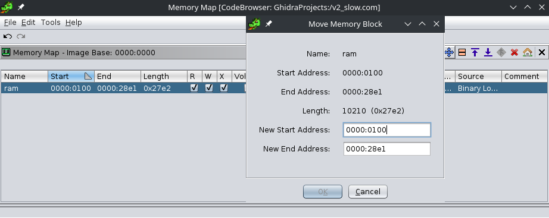

# The Return of Too Slow

A computer manufactured in the 1980s is on display in the Rhiza museum. That computer is never turned off and is kept running some MS-DOS software. It is said to contain one of the first advanced AI algorithms produced by mankind, which was programmed to answer the problem of faster-than-light space travel. The government keeps the computer running in the hope that someday the program will complete and show the result of its execution. Colonization of other planets would be the only means for humanity to expand again now that, according to the government, humans can't inhabit large regions outside Rhiza.

Laura knows that this is obviously nonsense. She suspects the program does something very straightforward, but that could not be implemented efficiently with the computers at the time. Are you able to unveil what this program is computing? Can you get the answer the program would show on screen, but much faster than it does?

Attachments:
* [enc](./enc)
* [v2_slow.com](./v2_slow.com)

## Solution

We are given a UPX compressed DOS file. After decompressing, I loaded the binary in Ghidra as 16 bit Real-Mode. Then I shifted the start of ram segment to 0x100 to match the start offset.

<p align="center"></p>

With some basic analysis and guesses we get the main function

### Main Function
```c
void __cdecl16near main(int argc,char **argv)
{
  undefined2 unaff_SS;
  long sz;
  undefined4 uVar1;
  FILE *fp;
  
  if (argc == 1) {
                    /* fopen( "enc" , "r") */
    fp = (FILE *)_fopen_((int)s_enc_0000_279a,(char *)s_r_0000_2798);
  }
  else {
                    /* fopen( file , "r") */
    fp = (FILE *)_fopen_((int)argv[1],(char *)s_r_0000_2798);
  }
                    /* fseek(fp, 0, SEEK_END) */
  _fseek_((uint *)fp,0,0,2);
  sz = _ftell_((int *)fp);
                    /* size ss[0x2970] = sz / 2 */
  *(uint *)0x2970 = (uint)(sz + 8) >> 1 | (uint)((sz + 8 & 0x10000U) != 0) << 0xf;
  _fclose_((int *)fp);
  if (argc == 1) {
                    /* fopen( "enc" , "r") */
    fp = (FILE *)_fopen_((int)s_enc_0000_279a,(char *)s_r_0000_2798);
  }
  else {
                    /* fopen( file , "r") */
    fp = (FILE *)_fopen_((int)argv[1],(char *)s_r_0000_2798);
  }
                    /* fread(void *data1, size_t size ss[0x2970], size_t nmemb, FILE *stream) */
  uVar1 = _fread_(0x48b4,*(uint *)0x2970,(uint *)0x1,(uint **)fp);
  if ((int)uVar1 == 0) {
    _exit_(1);
  }
  *(undefined *)(*(int *)0x2970 + 0x48b4) = 0;
                    /* fread(void *data2, size_t size ss[0x2970], size_t nmemb, FILE *stream) */
  uVar1 = _fread_(0x2972,*(uint *)0x2970,(uint *)0x1,(uint **)fp);
  if ((int)uVar1 == 0) {
    _exit_(1);
  }
  *(undefined *)(*(int *)0x2970 + 0x2972) = 0;
  _fclose_((int *)fp);
  dec();
                    /* Probably print output ss[0x3912] */
  FUN_0000_1582((char *)0x3912);
  return;
}
```

We can guess the fopen, fseek, ftell, fclose & fread by their inputs and comparing with their source codes. I used [this](https://www.retro11.de/ouxr/211bsd/usr/src/lib/libc/)

- It opens `enc` file and reads it's total size (`sz`).
- It calculates `sz/2` and stores it at address `0x2970` (size).
- Then it open `enc` again and reads `sz/2` length of chars and stores at address `0x48b4`
- It reads the rest `sz/2` length of chars and stores at address `0x2972` and closes the file.

For easy analysis, I made...
```c
char * data1  = ss[0x48b4];   //--> [len(enc) / 2] 1st part
char * data2  = ss[0x2972];   //--> [len(enc) / 2] 2nd part
size_t * size = ss[0x2970];   // 2996/2 --> 1498

char * buffer1 = ss[0x40e4];
char * buffer2 = ss[0x3142];
char * output  = ss[0x3912];
```

### `dec` Function
```c
void dec(void)
{
  bool a;
  int j;
  
  int i = 0;
  _memset_(buffer1,0,2000);
  while( true ) {
    a = FUN_0000_023a();
    if (a == false) break;
    j = FUN_0000_02a6();
    a = FUN_0000_0312();
    if ((a == true) && (i < j)) {
      FUN_0000_1978(output,buffer2);
      i = j;
    }
  }
  return;
}
```

Full decompilation/analysis of functions in dec [here](./reference.c)

- It first fills `buffer1` with 2000 null bytes.
- `FUN_0000_023a` increments binary array `buffer1` by 1 and checks if the number of bits is less than `size` or not. The program breaks if it exceeds `size`.
- `FUN_0000_02a6` grabs some specific values from `data1` and stores it into `buffer2` with using `buffer1` as a bitmask filter. It returns the length of `buffer2`.
- `FUN_0000_0312` checks if the sequence of `buffer2` is present in `data2` or not.
- If the sequence is found and it's length is greater than the previous one, `buffer2` is copied into out.

The algorithm seems like a bruteforce form of [Longest Common Subsequence](https://www.geeksforgeeks.org/longest-common-subsequence-dp-4/)

## Solution

I split the `enc` string into two equal parts and ran LCS. Script [here](./solve.py)

## Flag
> `CTF-BR{baby_rev_flag_it_is_veeeeeeery_loooooooooooooooooooooong_to_take_tooooooooooooo_looooooooooong_time_perhaps_some_days_or_years_or_universe_age}`
