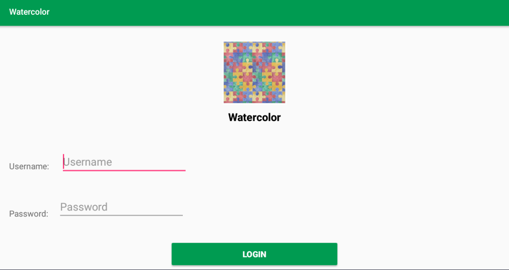
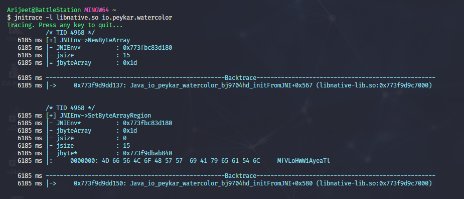

# Water Color

Well we think this puzzle is hard!

Attachments:
* [watercolor.apk](./watercolor.apk)

## Solution
Used Bluestacks to emulate and jadx-gui to decompile the apk.

<p align="center"></p>

This is the obfuscated MainActivity of the app.
```java
public class bj9704hd extends Fragment {
    String sf8352oh;
    String tq9643uf;

    public native void extraInfo();

    public native byte[] initFromJNI();

    static {
        System.loadLibrary("native-lib");
    }

    public void onCreate(Bundle bundle) {
        super.onCreate(bundle);
    }

    public View onCreateView(LayoutInflater layoutInflater, ViewGroup viewGroup, Bundle bundle) {
        View inflate = layoutInflater.inflate(R.layout.fragment_login, viewGroup, false);
        final EditText editText = (EditText) inflate.findViewById(R.id.usernametext);
        final EditText editText2 = (EditText) inflate.findViewById(R.id.passwordtext);
        ((Button) inflate.findViewById(R.id.loginbtn)).setOnClickListener(new View.OnClickListener() {
            public void onClick(View view) {
                bj9704hd.this.sf8352oh = editText.getText().toString();
                bj9704hd.this.tq9643uf = editText2.getText().toString();
                if (bj9704hd.this.sf8352oh.matches("") || bj9704hd.this.tq9643uf.matches("")) {
                    Toast.makeText(bj9704hd.this.getActivity().getApplicationContext(), "Username and Password are required", 0).show();
                } else if (new dh7645oi().wr9452tb(bj9704hd.this.tq9643uf)) {
                    bj9704hd.this.extraInfo();
                    SharedPreferences.Editor edit = bj9704hd.this.getActivity().getSharedPreferences("watercolor", 0).edit();
                    edit.putString("password", bj9704hd.this.tq9643uf);
                    edit.commit();
                    bj9704hd.this.getActivity().getSupportFragmentManager().beginTransaction().replace(R.id.fragment_container, new nt9923ng()).addToBackStack("main").commit();
                } else {
                    Toast.makeText(bj9704hd.this.getActivity().getApplicationContext(), "Incorrect Username or Password", 0).show();
                }
            }
        });
        return inflate;
    }

    class dh7645oi {
        Cipher uh7608nh;

        public dh7645oi() {
            try {
                MessageDigest instance = MessageDigest.getInstance("SHA-256");
                byte[] initFromJNI = bj9704hd.this.initFromJNI();
                instance.update(initFromJNI, 0, initFromJNI.length);
                SecretKeySpec secretKeySpec = new SecretKeySpec(instance.digest(), "AES");
                Cipher instance2 = Cipher.getInstance("AES");
                this.uh7608nh = instance2;
                instance2.init(1, secretKeySpec);
            } catch (NoSuchAlgorithmException e) {
                e.printStackTrace();
            } catch (InvalidKeyException e2) {
                e2.printStackTrace();
            } catch (NoSuchPaddingException e3) {
                e3.printStackTrace();
            }
        }

        public String fg8461gs(String str) {
            try {
                return Base64.encodeToString(this.uh7608nh.doFinal(str.getBytes()), 2);
            } catch (BadPaddingException e) {
                e.printStackTrace();
                return "";
            } catch (IllegalBlockSizeException e2) {
                e2.printStackTrace();
                return "";
            }
        }

        public boolean wr9452tb(String str) {
            try {
                String readLine = new BufferedReader(new InputStreamReader(bj9704hd.this.getActivity().getAssets().open("uw7289nv"))).readLine();
                if (readLine == null || !readLine.equals(fg8461gs(str))) {
                    return false;
                }
                return true;
            } catch (IOException e) {
                e.printStackTrace();
                return false;
            }
        }
    }
}
```

It checks only the password when we try to login. The check is as follows...
- `initFromJNI` from native library gives a string. The SHA-256 digest of the string is used as a key for AES ECB (No IV was used)
- The password is encryped using the above AES instance
- The encrypted password is base64 encoded and checked with asset `uw7289nv` which is...

`r6EszdHWf8TkNrC+BLfiXILGelpBPHw7koCOeLpBv8w=` --> `afa12ccdd1d67fc4e436b0be04b7e25c82c67a5a413c7c3b92808e78ba41bfcc`

**Password**

I have Bluestacks rooted and ADB with Frida Server... So I used JNItrace to log the JNI and tried to login...

<p align="center"></p>

Key is `MfVLoHWWiAyeaTl` SHA-256 --> `770f97bc76546a3508b6be54adac963af6e86f67551993904f56feccb0ce2388`

AES decrypting it gives the password `Th!$_!$_$uPp0s3d_t0_63_$3cur3`

There is another function that is called from native library when we succesfully login `extraInfo`. I used IDA to decompile the native library, at the end of the function we see this...

```cpp
  __android_log_print(4LL, "watercolor", "valid username is: %s", v3);
```
So instead of reversing the function I used ADB logcat to see the logs, then logged in the apk with the valid password.

**Username**

```
04-26 19:35:23.335  1520  1577 I audio_hw_primary: choose pcmC0D0p for 0
04-26 19:35:23.337  5105  5105 I watercolor: valid username is: !@W@t3RC^l3r&$3cr3t!U53R#
04-26 19:35:23.352  5105  5114 I art     : Do partial code cache collection, code=24KB, data=29KB
04-26 19:35:23.354  5105  5114 I art     : After code cache collection, code=24KB, data=29KB
04-26 19:35:23.354  5105  5114 I art     : Increasing code cache capacity to 128KB
04-26 19:35:23.362  1846  1877 D InputMethodManagerService: packageName=io.peykar.watercolor, activityName=.kg8923um
```

So username is `!@W@t3RC^l3r&$3cr3t!U53R#`

Now we got the username and password but where is flag??? There is a `solvedPuzzleUI` function in another class...

### solvedPuzzleUI
```java
    private void solvedPuzzleUI() {
        LinearLayout linearLayout = (LinearLayout) this.hd9863mm.findViewById(R.id.pauseContainer);
        getLayoutInflater().inflate(R.layout.puzzle_solved_ui, linearLayout, true);
        linearLayout.setClickable(true);
        linearLayout.setVisibility(0);
        ((Button) this.hd9863mm.findViewById(R.id.okBtn)).setOnClickListener(new View.OnClickListener() {
            public void onClick(View view) {
                new Thread(new Runnable() {
                    public void run() {
                        try {
                            URI uri = new URI(kj0762ey.this.ss2176jv.getResources().getString(R.string.hostname));
                            OkHttpClient unused = kj0762ey.this.fs9572kw = se5498vr.ab3702ns(uri.getHost(), kj0762ey.this.ss2176jv.getResources().getString(R.string.fingerprint));
                            String string = kj0762ey.this.gs0973mt.getString("password", "");
                            JSONObject jSONObject = new JSONObject();
                            try {
                                jSONObject.put("username", "find a valid username to capture the flag");
                                jSONObject.put("password", string);
                                kj0762ey.this.fs9572kw.newCall(new Request.Builder().url(uri.toURL()).post(RequestBody.create(kj0762ey.this.yh5921pa, jSONObject.toString())).build()).enqueue(new Callback() {
                                    public void onFailure(Call call, IOException iOException) {
                                        Log.i("watercolor", "Failure in sending request");
                                        iOException.printStackTrace();
                                    }

                                    public void onResponse(Call call, Response response) {
                                        Log.i("watercolor", "Response received successfully");
                                    }
                                });
                            } catch (JSONException e) {
                                e.printStackTrace();
                            }
                        } catch (Exception e2) {
                            e2.printStackTrace();
                        }
                    }
                }).start();
                kj0762ey.this.getActivity().getSupportFragmentManager().popBackStack();
                kj0762ey.this.getActivity().getSupportFragmentManager().beginTransaction().replace(R.id.fragment_container, new bj9704hd()).addToBackStack("login").commit();
            }
        });

```

On solving the puzzle it sends a JSON with username and password to the address in `hostname`.

In `Resources/resources.arsc/res/values/strings.xml` we get the hostname `https://water-color.peykar.io`

I made a post request with curl to get the flag
```
curl --header "Content-Type: application/json" \
  --request POST \
  --data '{"username":"!@W@t3RC^l3r&$3cr3t!U53R#","password":"Th!$_!$_$uPp0s3d_t0_63_$3cur3"}' \
  https://water-color.peykar.io

{"flag":"S4CTF{W4t3r_C0l0r_is_Beaut1fu1_But_Danger0u5_B3_C4r3ful!!}"}
```

## Flag
> `S4CTF{W4t3r_C0l0r_is_Beaut1fu1_But_Danger0u5_B3_C4r3ful!!}`