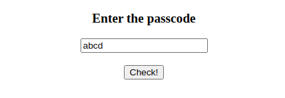
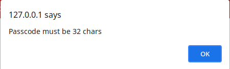
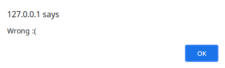
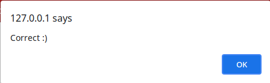

# Building a House

Can you figure out the passcode?

It looks like its just a Javascript bypass that you can easily do with a bit of Javascript magic, but is it this easy?

Attachments:
* [chal.html](./chal.html)
* [chal.js](./chal.js)
* [chal.wasm](./chal.wasm)

## Solution

So I hosted this on my local system with apache2 server.
<p align="center"></p>
Trying with random word.
<p align="center"></p>
The length must be 32 chars.
<p align="center"></p>

### Analysis HTML

```js
const __syscall12 = Module.cwrap('__syscall12', 'number', ['string']);
const __syscall15 = Module.cwrap('__syscall15', null, ['number']);
Module.onRuntimeInitialized = _=>{
    Module.ccall('emscripten_heap_init', null, null);
}
;
function checkPasscode() {
    var passcode = document.getElementById("passcode").value;
    if (passcode.length != 32) {
        alert("Passcode must be 32 chars");
    } else {
        __syscall15(__syscall12(passcode));
    }
}
```
In the HTML file we see that `__syscall15` & `__syscall12` are doing the passcode check and stuff.

### WASM analysis

If we open the wasm in chrome debugger we see the required functions. (`__syscall15` & `__syscall12`)

I used [rewasm](https://github.com/benediktwerner/rewasm) to decompile the wasm binary. [Decompiled code](./output.dec).

```
    var_1 = global_0 - 16;
    var_2 = global_0 - 16;
    global_0 = var_2;
    store<i32>(var_1 + 8, arg_0)
    store<i32>(var_1 + 4, 0)
    while true {
        var_3 = load<i32>(var_1 + 4) <s 32;
        if (var_3 & 1) == 0 {
            break;
        }
        var_4 = load<i32>(var_1 + 8);
        var_5 = var_4 + load<i32>(var_1 + 4);
        var_6 = load_8u<i32>(var_5);
        var_7 = load<i32>(var_1 + 4);
        store_8<i32>(var_7 + 2880, var_6)
        var_8 = load<i32>(var_1 + 4) + 1;
        store<i32>(var_1 + 4, var_8)
    }
```
It takes our passcode and stores it at address `2880`

```
    var_9 = load_8u<i32>(0 + 2880) << 24;
    var_10 = var_9 >>s 24 != 71 & 1;
    if var_10 == 0 {
        var_11 = load_8u<i32>(0 + 2881) << 24;
        var_12 = var_11 >>s 24 != 70 & 1;
        if var_12 == 0 {
            var_13 = load_8u<i32>(0 + 2882) << 24;
            var_14 = var_13 >>s 24 != 36 & 1;
            if var_14 == 0 {
                var_15 = load_8u<i32>(0 + 2883) << 24;
                var_16 = var_15 >>s 24 != 56 & 1;
                if var_16 == 0 {
                    var_17 = load_8u<i32>(0 + 2911) << 24;
                    var_18 = var_17 >>s 24 != 82 & 1;
                    if var_18 == 0 {
```
The first checks are simple. It compares `input[x - 2880] == y`
```
var_19 = load_8u<i32>(0 + 2889) << 24;
var_20 = load_8u<i32>(0 + 2907) << 24;
var_21 = load_8u<i32>(0 + 2881) << 24;
var_22 = var_19 >>s 24;
var_23 = var_20 >>s 24;
var_24 = var_21 >>s 24;
var_25 = func_5(var_22, var_23, var_24);
if var_25 {
    var_26 = load_8u<i32>(0 + 2894) << 24;
    var_27 = load_8u<i32>(0 + 2898) << 24;
    var_28 = load_8u<i32>(0 + 2911) << 24;
    var_29 = var_26 >>s 24;
    var_30 = var_27 >>s 24;
    var_31 = var_28 >>s 24;
    var_32 = func_5(var_29, var_30, var_31);
    if var_32 {
```
Next part takes 3 bytes and passes to `func_5`

### `func_5`
```
fn func_5(arg_0: i32, arg_1: i32, arg_2: i32) -> i32 {
    let var_3: i32;
    let var_4: i32;
    let var_5: i32;
    let var_6: i32;
    let var_7: i32;
    let var_8: i32;
    let var_9: i32;
    let var_10: i32;
    
    var_3 = global_0 - 48;
    var_4 = global_0 - 48;
    global_0 = var_4;
    store<i32>(var_3 + 44, arg_0)
    store<i32>(var_3 + 40, arg_1)
    store<i32>(var_3 + 36, arg_2)
    store<i32>(var_3 + 28, 1795)
    var_5 = load<i32>(var_3 + 28);
    store_8<i32>(var_3 + 24, 105)
    store_8<i32>(var_3 + 25, 105)
    store_8<i32>(var_3 + 26, 105)
    store_8<i32>(var_3 + 27, 0)
    var_6 = load<i32>(var_3 + 44);
    var_7 = load<i32>(var_3 + 40);
    var_8 = load<i32>(var_3 + 36);
    store<i32>(var_3 + 8, var_8)
    store<i32>(var_3 + 4, var_7)
    store<i32>(var_3, var_6)
    var_9 = var_3 + 24;
    var_10 = env.emscripten_asm_const_int(var_5, var_9, var_3);
    store<i32>(var_3 + 32, var_10)
    global_0 = var_3 + 48;
    return load<i32>(var_3 + 32);
}
```
It passes `1795`, `["i", "i", "i"]`, `[arg_0, arg_1, arg_2]` to `emscripten_asm_const_int` JS function

### `emscripten_asm_const_int`
```js
function _emscripten_asm_const_int(code, sigPtr, argbuf) {
    var args = readAsmConstArgs(sigPtr, argbuf);
    if (!ASM_CONSTS.hasOwnProperty(code))
        abort('No EM_ASM constant found at address ' + code);
    return ASM_CONSTS[code].apply(null, args);
}
```
It parses the 2nd and 3rd arguments and calls `ASM_CONSTS` function at `arg_0`

### `ASM_CONSTS`
```js
var ASM_CONSTS = {
    1424: function($0, $1) {
        s = "";
        for (var i = 0; i < $1; i++) {
            s += String.fromCharCode(getValue($0 + i, 'i8'));
        }
        eval(atob(s));
    },
    1532: function($0, $1, $2, $3, $4) {
        var arr = new Uint8Array($4);
        for (var i = 0; i < $4; i++) {
            arr[i] = getValue($3 + i);
        }
        var module = new WebAssembly.Module(arr);
        var module_instance = new WebAssembly.Instance(module);
        var result = module_instance.exports.f($0, $1);
        return (result == $2);
    },
    1795: function($0, $1, $2) {
        var arr = new Uint8Array([0x00, 0x61, 0x73, 0x6d, 0x01, 0x00, 0x00, 0x00, 0x01, 0x88, 0x80, 0x80, 0x80, 0x00, 0x01, 0x60, 0x03, 0x7f, 0x7f, 0x7f, 0x01, 0x7f, 0x03, 0x82, 0x80, 0x80, 0x80, 0x00, 0x01, 0x00, 0x04, 0x84, 0x80, 0x80, 0x80, 0x00, 0x01, 0x70, 0x00, 0x00, 0x05, 0x83, 0x80, 0x80, 0x80, 0x00, 0x01, 0x00, 0x01, 0x06, 0x81, 0x80, 0x80, 0x80, 0x00, 0x00, 0x07, 0x8e, 0x80, 0x80, 0x80, 0x00, 0x02, 0x06, 0x6d, 0x65, 0x6d, 0x6f, 0x72, 0x79, 0x02, 0x00, 0x01, 0x66, 0x00, 0x00, 0x0a, 0x96, 0x80, 0x80, 0x80, 0x00, 0x01, 0x90, 0x80, 0x80, 0x80, 0x00, 0x00, 0x20, 0x01, 0x20, 0x00, 0x6a, 0x41, 0x02, 0x6d, 0x20, 0x02, 0x41, 0x20, 0x6a, 0x46, 0x0b]);
        var module = new WebAssembly.Module(arr);
        var module_instance = new WebAssembly.Instance(module);
        var result = module_instance.exports.f($0, $1, $2);
        return result;
    },
    2521: function($0, $1, $2) {
        var a = String.fromCharCode($0);
        var b = String.fromCharCode($1);
        var c = String.fromCharCode($2);
        return (btoa(a + b + c) == "OU9u");
    },
    2656: function($0, $1) {
        s = "";
        for (var i = 0; i < $1; i++) {
            s += String.fromCharCode(getValue($0 + i, 'i8'));
        }
        alert(s);
    },
    2759: function($0, $1) {
        s = "";
        for (var i = 0; i < $1; i++) {
            s += String.fromCharCode(getValue($0 + i, 'i8'));
        }
        console.log(s);
    }
};
```
This has many functions in this array. `func_5` calls `1795`. `1795` function uses opcodes to make a wasm function and calls it with the arguments.

### `ASM_CONSTS[1795]`
```
(module
  (table $table0 0 funcref)
  (memory $memory (;0;) (export "memory") 1)
  (func $f (;0;) (export "f") (param $var0 i32) (param $var1 i32) (param $var2 i32) (result i32)
    local.get $var1
    local.get $var0
    i32.add
    i32.const 2
    i32.div_s
    local.get $var2
    i32.const 32
    i32.add
    i32.eq
  )
)
```
We can use chrome debugger to get the wasm code. It basically compares `(arg_0 + arg_1)/2` to `arg_2 + 32`

So `func_5` basically returns `(arg_0 + arg_1)/2 == arg_2 + 32`

```
var_33 = load_8u<i32>(0 + 2889) << 24;
var_34 = load_8u<i32>(0 + 2898) << 24;
var_35 = (var_33 >>s 24) - (var_34 >>s 24);
if (var_35 != -12 & 1) == 0 {
    var_36 = load_8u<i32>(0 + 2907) << 24;
    var_37 = load_8u<i32>(0 + 2894) << 24;
    var_38 = (var_36 >>s 24) + (var_37 >>s 24);
    if (var_38 != 216 & 1) == 0 {
```
Next part does some arithmetic operations on our input chars and compares it some fixed values.

```
var_39 = load_8u<i32>(0 + 2908) << 24;
var_40 = var_39 >>s 24;
var_41 = func_4(var_40, 5, 233);
if var_41 {
    var_42 = load_8u<i32>(0 + 2895) << 24;
    var_43 = var_42 >>s 24;
    var_44 = func_4(var_43, 3, 178);
    if var_44 {
        var_45 = load_8u<i32>(0 + 2890) << 24;
        var_46 = var_45 >>s 24;
        var_47 = func_4(var_46, 7, 155);
        if var_47 {
```
Next part calls `func_4` on some chars of input.

### `func_4`
It is a big function but we dont need to understand the full function. It calls `emscripten_asm_const_int` with `1532`, `["i", "i", "i", "i", "i"]`, `[arg_0, arg_1, arg_2, address_of_some_data, 107]`

### `ASM_CONSTS[1532]`
It creates a wasm module from opcodes using the 4th and 5th arguments. And calls it `arg_0, arg_1` and compares the output to `arg_2`.

```
(module
  (table $table0 0 funcref)
  (memory $memory (;0;) (export "memory") 1)
  (func $f (;0;) (export "f") (param $var0 i32) (param $var1 i32) (result i32)
    local.get $var0
    i32.const 8
    local.get $var1
    i32.sub
    i32.shr_s
    local.get $var0
    local.get $var1
    i32.shl
    i32.or
    i32.const 255
    i32.and
  )
)
```
The function seems to be `rol` implementation. So `func_4(x,y,z)` seems to be `rol(x,y) == z`

```
var_48 = func_6(8, 5);
if var_48 {
```
Next part calls `func_6`

### `func_6`
```
    store<i32>(global_0 - 32 + 24, arg_0)
    store<i32>(global_0 - 32 + 20, arg_1)
    var_2 = global_0 - 32 + 15 + 4;
    var_3 = load_8u<i32>(0 + 1375);
    store_8<i32>(var_2, var_3)
    var_4 = load<i32>(0 + 1371);
    store<i32>(global_0 - 32 + 15, var_4)
    store<i32>(global_0 - 32 + 8, 0)
    while true {
        var_5 = load<i32>(global_0 - 32 + 8);  // counter
        var_6 = load<i32>(global_0 - 32 + 20); // range --> arg1
        if (var_5 <s var_6 & 1) == 0 {
            store<i32>(global_0 - 32 + 28, 1)
            break;
        }
        var_7 = load<i32>(global_0 - 32 + 24);  // arg0
        var_8 = load<i32>(global_0 - 32 + 8);   // counter
        var_9 = load_8u<i32>(var_7 - var_8 + 2880); // input [arg0 - counter] --> x1
        var_10 = load<i32>(global_0 - 32 + 24);
        var_11 = load<i32>(global_0 - 32 + 8);
        var_12 = var_10 - var_11 - 1;
        var_13 = load_8u<i32>(var_12 + 2880) << 24; // input [arg0 - counter - 1] --> x2
        var_14 = var_13 >>s 24;
        var_15 = (var_9 << 24 >>s 24) - var_14; // x1 - x2
        var_16 = load<i32>(global_0 - 32 + 8);
        var_17 = global_0 - 32 + 15 + var_16;
        var_18 = load_8u<i32>(var_17) << 24 >>s 24;
        if (var_15 != var_18 & 1) == 0 {
            store<i32>(global_0 - 32 + 28, 0)
            break;
        }
        var_19 = load<i32>(global_0 - 32 + 8); // update counter
        store<i32>(global_0 - 32 + 8, var_19 + 1)
    }
    var_20 = load<i32>(global_0 - 32 + 28);
    return var_20;
```
This code is equivalent to
```py
for i in range(5):
    input[8 - i] - input[8 - i - 1] == x
```
It uses some global values to get `x`, I just debugged using chrome tools, breakpoint at `0x6ac` and got the values of `x`.

```
var_49 = func_7(11, 12, 13);
if var_49 {
```
Next part calls `func_7`

### `func_7`
It calls `emscripten_asm_const_int` with `2521`, `["i", "i", "i"]`, `[arg_0, arg_1, arg_2]`

### `ASM_CONSTS[2521]`
```js
var a = String.fromCharCode($0);
var b = String.fromCharCode($1);
var c = String.fromCharCode($2);
return (btoa(a + b + c) == "OU9u");
```
btoa encodes text to base64. `OU9u` decodes to `9On`. So func_7 does `chr(arg_0) == '9' and chr(arg_1) == 'O' and chr(arg_2) == 'n'`

```
var_50 = load_8u<i32>(0 + 2896) << 24;
var_51 = load_8u<i32>(0 + 2897) << 24;
var_52 = var_50 >>s 24 & var_51 >>s 24;
if (var_52 != 53 & 1) == 0 {
    var_53 = load_8u<i32>(0 + 2897) << 24;
    var_54 = load_8u<i32>(0 + 2909) << 24;
    var_55 = (var_53 >>s 24) - (var_54 >>s 24);
    if (var_55 != -15 & 1) == 0 {
        var_56 = load_8u<i32>(0 + 2909) << 24;
        var_57 = load_8u<i32>(0 + 2910) << 24;
        var_58 = (var_56 >>s 24) | (var_57 >>s 24);
        if (var_58 != 116 & 1) == 0 {
            var_59 = load_8u<i32>(0 + 2910) << 24;
            var_60 = load_8u<i32>(0 + 2896) << 24;
            var_61 = (var_59 >>s 24) + (var_60 >>s 24);
            if (var_61 != 107 & 1) == 0 {
                var_62 = func_8(19);
                if var_62 {
                    store<i32>(var_1 + 12, 1)
                }
```
Next are some more arithmetic and binary operations on some chars and compares to some fixed values. Then it calls `func_8`

### `func_8`
```
store<i32>(global_0 - 32 + 24, arg_0)
var_1 = global_0 - 32 + 19 + 4;
var_2 = load_8u<i32>(0 + 1028);
store_8<i32>(var_1, var_2)
var_3 = load<i32>(0 + 1024);
store<i32>(global_0 - 32 + 19, var_3)
var_4 = load<i64>(0 + 1376);
store<i64>(global_0 - 32 + 11, var_4)
store<i32>(global_0 - 32 + 4, 0)
while true {
    var_5 = load<i32>(global_0 - 32 + 4); // counter
    if (var_5 <s 8 & 1) == 0 {
        store<i32>(global_0 - 32 + 28, 1)
        break;
    }
    var_6 = load<i32>(global_0 - 32 + 24);
    var_7 = load<i32>(global_0 - 32 + 4);
    var_8 = load_8u<i32>(var_6 + var_7 + 2880); // input[arg + counter] --> x
    var_9 = load<i32>(global_0 - 32 + 4);
    var_10 = rem_s(var_9, 4);
    var_11 = global_0 - 32 + 19 + var_10;
    var_12 = load_8u<i32>(var_11) & 255;
    var_13 = var_8 << 24 >>s 24 ^ var_12; // x ^ var_12
    var_14 = load<i32>(global_0 - 32 + 4);
    var_15 = global_0 - 32 + 11 + var_14;
    var_16 = load_8u<i32>(var_15) & 255;
    var_17 = var_13 + 1 != var_16 & 1; // (x ^ var_12) + 1 != var_16
    if var_17 == 0 {
        store<i32>(global_0 - 32 + 28, 0)
        break;
    }
    var_18 = load<i32>(global_0 - 32 + 4);
    store<i32>(global_0 - 32 + 4, var_18 + 1)
}
var_19 = load<i32>(global_0 - 32 + 28);
return var_19;
```
This code is equivalent to
```py
for i in range(8):
    (input[arg_0 + i] ^ x) + 1 == y
```
It uses some global values to get `x` and `y`, breakpoint at `0x949` & `0x993` got the values of `x` and `y`.

## Solver Script
So I made a z3 script adding all the constraints which gave the passcode. [here](./solver.py)

Passcode : `GF$8J!4jsf79OnrV75riE%tKcT0fOD4R`.
<p align="center"></p>

But where flag??. Console shows `Stop using DevTools, no flag for you :|`

## `__syscall15`
```
    var_1 = global_0 - 64;
    var_2 = global_0 - 64;
    global_0 = var_2;
    store<i32>(var_1 + 60, arg_0)
    if load<i32>(var_1 + 60) {
        store<i32>(var_1 + 56, 1230)
        store<i32>(var_1 + 52, 10)
    }
    else {
        store<i32>(var_1 + 56, 1241)
        store<i32>(var_1 + 52, 8)
    }
    store<i32>(var_1 + 48, 2656)
    var_3 = load<i32>(var_1 + 48);
    store_8<i32>(var_1 + 45, 105)
    store_8<i32>(var_1 + 46, 105)
    store_8<i32>(var_1 + 47, 0)
    var_4 = load<i32>(var_1 + 56);
    var_5 = load<i32>(var_1 + 52);
    store<i32>(var_1 + 20, var_5)
    store<i32>(var_1 + 16, var_4)
    var_6 = var_1 + 45;
    var_7 = var_1 + 16;
    env.emscripten_asm_const_int(var_3, var_6, var_7);
    var_8 = load<i32>(var_1 + 60) == 1;
    if (var_8 & 1) != 0 {
        store<i32>(var_1 + 40, 0)
        while true {
            var_9 = load<i32>(var_1 + 40) <s 32;
            if (var_9 & 1) == 0 {
                break;
            }
            var_10 = load<i32>(var_1 + 40);
            var_11 = load_8u<i32>(var_10 + 2880) << 24;
            var_12 = load<i32>(var_1 + 40);
            var_13 = load<i32>(var_1 + 40);
            var_14 = load_8u<i32>(var_13 + 1392) & 255;
            store_8<i32>(var_12 + 1392, var_14 ^ var_11 >>s 24)
            var_15 = load<i32>(var_1 + 40) + 1;
            store<i32>(var_1 + 40, var_15)
        }
        store<i32>(var_1 + 36, 2759)
        var_16 = load<i32>(var_1 + 36);
        store_8<i32>(var_1 + 33, 105)
        store_8<i32>(var_1 + 34, 105)
        store_8<i32>(var_1 + 35, 0)
        store<i32>(var_1 + 4, 32)
        store<i32>(var_1, 1392)
        var_17 = var_1 + 33;
        env.emscripten_asm_const_int(var_16, var_17, var_1);
    }
```
Initial part checks whether our passcode is correct and alerts with correct or wrong(`emscripten_asm_const_int` with `2656` does alert with string). After that our input is xored with buffer at `1392` and call to `emscripten_asm_const_int` is done with `2759` (does console.log with string).
```
(data (i32.const 1392) "\14u`C=\12V5G\15D\0a\22\0cC/h\04\016&\15D'<&\01\01'0\0b/")
```
So we xored our input to the buffer at `1392` to get the flag.

## Flag
>  `S3D{w3b_4ss3mb1y_1s_c00l_r1ght?}`