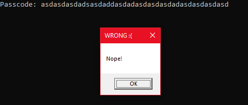
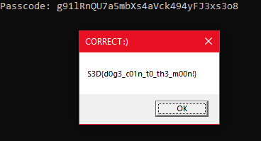

# Knock Knock

Knock Knock - what is the passcode?

Attachments:
* [chal.exe](./chal.exe)

## Solution
Running the program asks for a passcode.
<p align="center"></p>

### Main
```c
int __cdecl main(int argc, const char **argv, const char **envp)
{
  char *v3; // eax
  char *v4; // eax
  char *v6; // eax
  char input[128]; // [esp+0h] [ebp-84h] BYREF

  v3 = self_decrypt(aUA);                       // Passcode: 
  vs_printf(v3);
  v4 = self_decrypt(&asc_40607C);               // %32s
  vs_scanf(v4, input, 128);
  if ( !check_inp_len(input) )
    return 1;
  get_funcs();
  check_VM();
  v6 = self_decrypt(aOEzeeus);                  // p4ssc0de
  SetEnvironmentVariableA(v6, input);
  sub_401390();
  return 0;
}
```
`self_decrypt` function decrypts some strings and returns a pointer to it. `check_inp_len` checks if our input has atleast 32 bytes.

### `get_funcs`
```c
void __stdcall get_funcs()
{
  int v0; // [esp+8h] [ebp-4h]

  v0 = (int)NtCurrentPeb()->UnicodeCaseTableData & 0x70;
  dword_4064CC = sub_401D40(v0 + 584300013);
  dword_4064C8 = sub_401D40(v0 + 1883303541);
  ZwUnmapViewOfSection = (int (__stdcall *)(_DWORD, _DWORD))sub_401DE0(dword_4064CC, v0 - 1146024627);
  NtQueryInformationProcess = sub_401DE0(dword_4064CC, v0 - 1140911902);
  CreateProcessW = (int (__stdcall *)(_DWORD, _DWORD, _DWORD, _DWORD, _DWORD, _DWORD, _DWORD, _DWORD, _DWORD, _DWORD))sub_401DE0(dword_4064C8, v0 - 1627980145);
  FindResourceA = (int (__stdcall *)(_DWORD, _DWORD, _DWORD))sub_401DE0(dword_4064C8, v0 - 1210081649);
  SizeofResource = (int (__stdcall *)(_DWORD, _DWORD))sub_401DE0(dword_4064C8, v0 - 61245283);
  LoadResource = (int (__stdcall *)(_DWORD, _DWORD))sub_401DE0(dword_4064C8, v0 - 2088459891);
  VirtualAllocEx = (int (__stdcall *)(_DWORD, _DWORD, _DWORD, _DWORD, _DWORD))sub_401DE0(dword_4064C8, v0 - 88265964);
  ReadProcessMemory = (int (__stdcall *)(_DWORD, _DWORD, _DWORD, _DWORD, _DWORD))sub_401DE0(dword_4064C8, v0 + 1247127737);
  WriteProcessMemory = (int (__stdcall *)(_DWORD, _DWORD, _DWORD, _DWORD, _DWORD))sub_401DE0(dword_4064C8, v0 + 1752002856);
  GetThreadContext = (int (__stdcall *)(_DWORD, _DWORD))sub_401DE0(dword_4064C8, v0 - 42970078);
  SetThreadContext = (int (__stdcall *)(_DWORD, _DWORD))sub_401DE0(dword_4064C8, v0 - 1880221010);
  ResumeThread = (int (__stdcall *)(_DWORD))sub_401DE0(dword_4064C8, v0 - 584652114);
  SetEnvironmentVariableA = (int (__stdcall *)(_DWORD, _DWORD))sub_401DE0(dword_4064C8, v0 + 87280781);
  CreateToolhelp32Snapshot = (int (__stdcall *)(_DWORD, _DWORD))sub_401DE0(dword_4064C8, v0 - 1900884235);
  Process32FirstW = (int (__stdcall *)(_DWORD, _DWORD))sub_401DE0(dword_4064C8, v0 - 1792896184);
  Process32NextW = (int (__stdcall *)(_DWORD, _DWORD))sub_401DE0(dword_4064C8, v0 - 44980001);
  ExitProcess = (int (__stdcall *)(_DWORD))sub_401DE0(dword_4064C8, v0 + 38237150);
  TerminateProcess = (int (__stdcall *)(_DWORD, _DWORD))sub_401DE0(dword_4064C8, v0 - 2036638803);
}
```
This function uses some relative address to load functions from DLL. (Got from debugging with x32dbg)

### `check_VM`

```c
void __stdcall check_VM()
{
  if ( sub_4018F0() || sub_401920() )
    ExitProcess(2);
}
```
```c
int sub_401920()
{
  char *String; // [esp+0h] [ebp-274h]
  char *lpString1; // [esp+4h] [ebp-270h]
  HANDLE hObject; // [esp+Ch] [ebp-268h]
  tagPROCESSENTRY32W v4; // [esp+10h] [ebp-264h] BYREF
  CHAR String2[52]; // [esp+23Ch] [ebp-38h] BYREF

  memset(&v4, 0, sizeof(v4));
  v4.dwSize = 556;
  hObject = (HANDLE)CreateToolhelp32Snapshot(2, 0);
  if ( hObject == (HANDLE)-1 )
    return 0;
  String = self_decrypt(aA);
  // vboxservice.exe;vboxtray.exe;vmtoolsd.exe;vmacthlp.exe;vmwaretray.exe;vmwareuser.exe;vmware.exe
  if ( Process32FirstW(hObject, &v4) )
  {
    do
    {
      sprintf(String2, "%ls", v4.szExeFile);
      for ( lpString1 = strtok(String, ";"); lpString1; lpString1 = strtok(0, ";") )
      {
        if ( !lstrcmpiA(lpString1, String2) )
          return 1;
      }
    }
    while ( Process32NextW(hObject, &v4) );
  }
  CloseHandle(hObject);
  return 0;
}
```
It checks if we are running this binary in a VM.

Then it sets Environment Variable `p4ssc0de` with our input. Then `sub_401390` is called.

### `sub_401390`
```c
    lpBuffer = sub_401C00(lpProcessInformation->hProcess);
    sub_401C80(lpProcessInformation->hProcess, lpBuffer[2]);
    v11 = FindResourceA(0, 101, RT_RCDATA);
    Size = SizeofResource(0, v11);
    Src = (void *)LoadResource(0, v11);
    memory = new(Size);
    memcpy(memory, Src, Size);
    decrypt_memory_chunk(memory, Size);
    v24 = sub_401180((int)memory);
    v20 = (_DWORD *)sub_401170((int)memory);
    if ( !ZwUnmapViewOfSection(lpProcessInformation->hProcess, lpBuffer[2])
      && VirtualAllocEx(lpProcessInformation->hProcess, lpBuffer[2], v20[20], 12288, 64)
      && (v7 = lpBuffer[2] - v20[13],
          v20[13] = lpBuffer[2],
          WriteProcessMemory(lpProcessInformation->hProcess, lpBuffer[2], memory, v20[21], 0)) )
```
The gist of the function :
- It created a new process
- Loads a Resource and decrypts it
- It writes the data into the process and continues it

So I debugged with x32dbg and used `savedata` to dump the resource, which is a [PE file](./prog_dump.exe).

### Analysis of Dumped Exe
```c
int __stdcall WinMain(HINSTANCE hInstance, HINSTANCE hPrevInstance, LPSTR lpCmdLine, int nShowCmd)
{
  char *v4; // eax
  char *v6; // [esp-4h] [ebp-8Ch]
  int v7; // [esp+0h] [ebp-88h]
  int v8; // [esp+0h] [ebp-88h]
  CHAR Buffer[128]; // [esp+4h] [ebp-84h] BYREF

  memset(Buffer, 0, sizeof(Buffer));
  sub_403360(Buffer);
  v7 = sub_4032E0((void (__cdecl *)(int))sub_402FC0, (int)Buffer);
  v8 = v7 + sub_4032E0((void (__cdecl *)(int))sub_403050, (int)Buffer);
  if ( v8 + sub_4032E0((void (__cdecl *)(int))sub_403110, (int)Buffer) )
  {
    v6 = decrypt_string(aEioou);                // WRONG :(
    v4 = decrypt_string(&asc_407028);           // Nope!
  }
  else
  {
    v6 = decrypt_string(aO);                    // CORRECT :)
    v4 = sub_4031A0(Buffer);
  }
  sub_403390(v4, v6);
  return 0;
}
```
### `sub_403360`
```c
DWORD __cdecl sub_403360(LPSTR lpBuffer)
{
  char *v1; // eax

  v1 = decrypt_string(aU);                      // p4ssc0de
  return GetEnvironmentVariableA(v1, lpBuffer, 0x80u);
}
```
`sub_403360` returns our input text from the Environment Variable `p4ssc0de`. `sub_402FC0`, `sub_403050`, `sub_403110` functions checks our input. If our checks are passed, `sub_4031A0` decrypts our flag with our input as key.

### Checks
```c
  for ( i = 0; i < 0xC; ++i )
    Buf1[i] = ((char)a1[i] >> 1) | (a1[i] << 7);
  return memcmp(Buf1, &unk_405110, 0xCu) != 0;
```
Simple ror
```c
  memset(v4, 0, sizeof(v4));
  memset(Buf1, 0, sizeof(Buf1));
  memcpy(v4, a1 + 12, 0xCu);
  sub_401030((int)&unk_405120, (int)v2);
  sub_4010E0(v2, v4, Buf1, 12);
  return memcmp(Buf1, &unk_405128, 0xCu) != 0;
```
RC4 Encryption Key : `b'\xAA\xBB\xCC\xDD'` Data : `b'\xB4\x29\x00\xEB\x36\xB5\x8F\xD2\xDA\x6A\x8A\x5D'`
```c
  key[0] = 0xA2;
  key[1] = 0x34;
  key[2] = 0xFA;
  key[3] = 0x37;
  key[4] = 0x12;
  key[5] = 0xEC;
  key[6] = 0x5B;
  key[7] = 0xA3;
  memcpy(data, a1 + 24, sizeof(data));
  v1 = sub_401C90(key, data, 8u);
  return memcmp(v1, &unk_405138, 0x10u) != 0;
```
DES Encryption Key : `b'\xA2\x34\xFA\x37\x12\xEC\x5B\xA3'` Data : `b'\x2E\x07\x67\xF3\xCC\x50\xB8\x9C\x50\xDD\x92\xD6\x1E\x9B\x17\xE5'`

Using this we get the passcode `g91lRnQU7a5mbXs4aVck494yFJ3xs3o8`. Using this passcode we run the binary
<p align="center"></p>

## Flag
>  `S3D{d0g3_c01n_t0_th3_m00n!}`