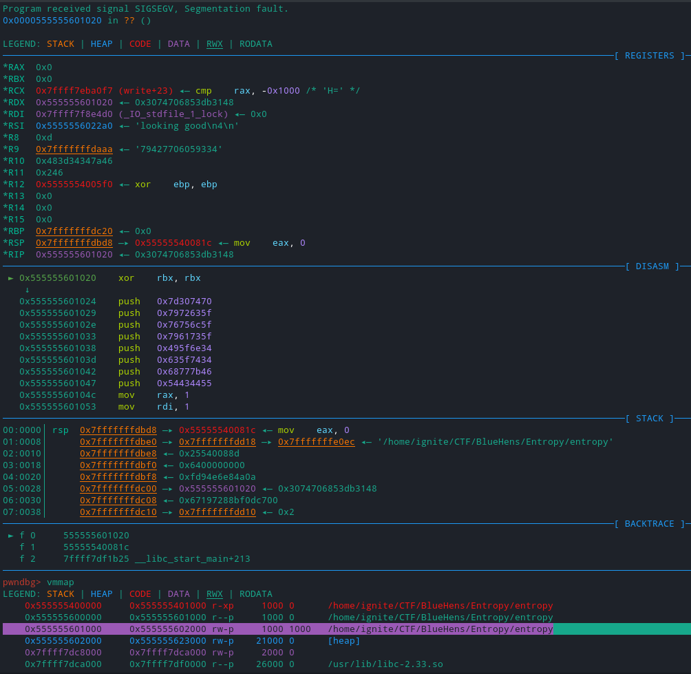

# Entropy

If you can find a 12-eye you can do this...

Attachments:
* [entropy](./entropy)

## Solution
Opened the binary in Ghidra, after some clearup (Rename and Retype variable), we got

### Main Function
```c
void main(int argc,char **argv)
{
  // Variable initialisations
  local_20 = *(long *)(in_FS_OFFSET + 0x28);
  puts(argv[1]);
  to_xor = *(ulong *)argv[1] & 0xffffffffffff;
  printf("%lu\n",to_xor);
  i = 0;
  for ( i = 0; i < 100; ++i )
  {
    enc_func[i] ^= FUN_001006fa(&to_xor);
    i = i + 1;
  }
  if (to_xor == 0xfd94e6e84a0a) {
    puts("looking good");
  }
  (*(void (**)(void))enc_func)();
  return;
}
```

### `FUN_001006fa` Function
```c
ulong FUN_001006fa(ulong *x)
{
  *x = *x * 0x5deece66d + 0xb & 0xffffffffffff;
  return *x;
}
```

So I just implemented the logic in z3 and it returned `[x = 79427706059334]` or x = `Fz44=H`. Script [here](./solve.py)

Running it gives
```
$ ./entropy Fz44=H
Fz44=H
79427706059334
looking good
[1]    31409 segmentation fault (core dumped)  ./entropy Fz44=H
```

So my input was right but there was some other error... Analyzing in gdb I see that the instructions wasn't execuatble in memory.

<p align="center"></p>

Ultimately it executes write syscall with the flag.
```
0x555555601020:      xor    rbx,rbx
0x555555601023:      push   rbx
0x555555601024:      push   0x7d307470
0x555555601029:      push   0x7972635f
0x55555560102e:      push   0x76756c5f
0x555555601033:      push   0x7961735f
0x555555601038:      push   0x495f6e34
0x55555560103d:      push   0x635f7434
0x555555601042:      push   0x68777b46
0x555555601047:      push   0x54434455
0x55555560104c:      mov    rax,0x1
0x555555601053:      mov    rdi,0x1
0x55555560105a:      mov    rsi,rsp
0x55555560105d:      mov    rdx,0x40
0x555555601064:      syscall 
```

## Flag
> UDCTF{wh4t_c4n_I_say_luv_crypt0}