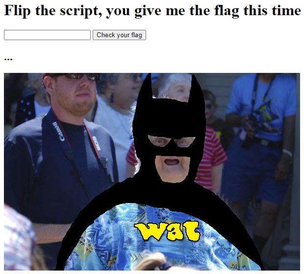

# Entropy

http://challenges.ctfd.io:30039/

## Solution

<p align="center"></p>

Java Script source:
```javascript
var $flagin = document.getElementById("flagme");
var $clickme = document.getElementById("done");
$clickme.addEventListener("click", function()
{
  (async()=>{
    const response = await fetch("checker.wasm");
    const file = await response.arrayBuffer();
    const wasm = await WebAssembly.instantiate(file);
    const {memory, flagChecker} = wasm.instance.exports;

    const encode = function stringToIntegerArray(string, array) {
      for (let i = 0; i < string.length; i++) {
        array[i] = string.charCodeAt(i);
      }
    };

    const plaintext = $flagin.value;
    const myArray = new Int32Array(memory.buffer,0,plaintext.length);

    encode(plaintext, myArray);
    console.log(myArray);

    let result = flagChecker(myArray.byteOffset, 128, 257);
    if (result === 0) {
      document.getElementById("msg").innerText = "Nice work, you figured out the flag!";
      document.getElementById("watman").src = "mel.jpg";
    } else {
      document.getElementById("msg").innerText = "Keep trying!";
    }
  })();
});
```
So I dumped the wasm binary with the help of Chrome Developer Tools. Then used `wasm2c` to get the header and source C files. Then compiled to a C binary for better analysis (`gcc -O3 source.c wasm-rt-impl.c`).

### `flagChecker` Function
```c
__int64 __fastcall w2c_flagChecker(unsigned int a1, int a2, int a3)
{
  int v3; // ebx
  int v5; // er9
  int v6; // eax
  bool v7; // r11
  unsigned int v8; // edi
  __int64 v9; // r8
  int v10; // edx
  __int64 result; // rax
  int v12; // eax

  v3 = wasm_rt_call_stack_depth++;
  if ( (unsigned int)wasm_rt_call_stack_depth > 0x1F4 )
    wasm_rt_trap(7);
  v5 = *(_DWORD *)(w2c_memory + a1);
  v6 = a2 * v5;
  if ( !a3 )
    wasm_rt_trap(3);
  v7 = a3 == -1;
  if ( v6 == 0x80000000 && a3 == -1 )
  {
LABEL_12:
    wasm_rt_call_stack_depth = v3;
    result = 1LL;
  }
  else
  {
    v8 = a1 + 4;
    v9 = 0LL;
    v10 = v6 % a3;
    result = 1LL;
    if ( v10 == 86 )
    {
      do
      {
        v12 = v5 & 1;
        v5 = *(_DWORD *)(w2c_memory + v8);
        a2 = (v12 == 0 ? 2 : 0) + a2 - 1;
        if ( v5 * a2 == 0x80000000 && v7 )
        {
          if ( *(_DWORD *)(w2c_memory + 4 * v9 + 1028) )
            goto LABEL_12;
        }
        else if ( v5 * a2 % a3 != *(_DWORD *)(w2c_memory + 4 * v9 + 1028) )
        {
          goto LABEL_12;
        }
        ++v9;
        v8 += 4;
      }
      while ( v9 != 27 );
      wasm_rt_call_stack_depth = v3;
      result = 0LL;
    }
    else
    {
      wasm_rt_call_stack_depth = v3;
    }
  }
  return result;
}
```
Implemention of the same in python will roughly look like:
```py
flag = []
enc_flag = [0x56, 0x9b, 0x5f, 0x83, 0xde, 0xbe, 0x45, 0x65, 0xe9, 0xb1, 0x51, 0xcf, 0x7f, 0xd5, 0x71, 0x35, 0xaa, 0x5e, 0x19, 0xda, 0xd9, 0x9e, 0x19, 0xf9, 0x48, 0xda, 0x43, 0xdb]

v10 = flag[0]
v11 = 128 * v10
v8 = 128
mod_val = 257

for i in range(1,28):
  v16 = v10 & 1;
  tmp = flag[i]
  v10 = tmp
  if(v16 == 0):
    v4 = 1
  else:
    v4 = -1
  v8 += v4
  v13 = v8 * tmp
  enc_flag[i] == v13 % mod_val
```

Solver script in python [here](./solve.py)

## Flag
> UDCTF{wh0a_w4sm_i5_lit_y4l1}