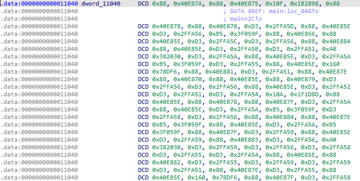

# Chains

flag machine go brrr

Attachments:
* [chains](./chains)

## Solution
We are given an ARM binary.

### Main Function
```c
void __cdecl main(int argc, const char **argv, const char **envp)
{
  unsigned int i; // [xsp+10h] [xbp+10h]
  unsigned int j; // [xsp+14h] [xbp+14h]
  int v5; // [xsp+18h] [xbp+18h]
  int v6; // [xsp+1Ch] [xbp+1Ch]

  for ( i = 0; i <= 0x29F7; i += 2 )
  {
    v6 = dword_11040[i];
    v5 = dword_11040[i + 1];
    for ( j = 1; j <= 899999999; ++j )
    {
      if ( v6 == (unsigned int)sub_7CC(j) )
        --v5;
      if ( !v5 )
      {
        putchar(j - 899999745);
        fflush(stdout);
        break;
      }
    }
  }
  putchar(10);
}
```
### `sub_7CC`
```c
__int64 __fastcall sub_7CC(unsigned int a1)
{
  unsigned int result; // [xsp+1Ch] [xbp-4h]

  result = 0;
  while ( a1 != 1 )
  {
    if ( (a1 & 1) != 0 )
      a1 = 3 * a1 + 1;
    else
      a1 >>= 1;
    ++result;
  }
  return result;
}
```
By looking this we can understand that this is an optimize me challenge. For the 1st optimisation I thought to make an array of `900000000` valus returned from the `sub_7CC` function. It was still too slow. So I looked into the int array and tried to figure out what value is checked to print the flag.

<p align="center"></p>

```c
for ( j = 1; j <= 899999999; ++j )
    {
      if ( v6 == (unsigned int)sub_7CC(j) )
        --v5;
      if ( !v5 )
      	putchar(j - 899999745);
```
Looking into the data array and the following array we can find out that it checks for the `v5`th instance of the value `v6`. So I made a dictionary of all the unique values (only 19) in the following order `instance : position returned from sub_7CC`.

Script [here](./gen.c). Running the script gives this after about 9 mins.
```
$ ./generator
[+] Generating Values
899999999
[+] Generation Done
 Ouput:UMASS{ oh, you want the flag? Too bad. Sit through this sponsored message first. The Collatz conjecture is a conjecture in mathematics that concerns a sequence defined as follows: start with any positive integer n. Then each term is obtained from the previous term as follows: if the previous term is even, the next term is one half of the previous term. If the previous term is odd, the next term is 3 times the previous term plus 1. The conjecture is that no matter what value of n, the sequence will always reach 1. Rawr x3 nuzzles how are you pounces on you you're so warm o3o notices you have a o:  hold up I need to make this message even longer In abstract algebra and analysis, the Archimedean property, named after the ancient Greek mathematician Archimedes of Syracuse, is a property held by some algebraic structures, such as ordered or normed groups, and fields. The property, typically construed, states that given two positive numbers x and y, there is an integer n so that nx > y. It also means that the set of natural numbers is not bounded above.[1] Roughly speaking, it is the property of having no infinitely large or infinitely small elements. It was Otto Stolz who gave the axiom of Archimedes its name because it appears as Axiom V of Archimedes’ On the Sphere and Cylinder. UMASS{7h15_15_4_f5ck1n6_l0n6_m355463_r07fl}
 ```

## Flag
> UMASS{7h15_15_4_f5ck1n6_l0n6_m355463_r07fl}