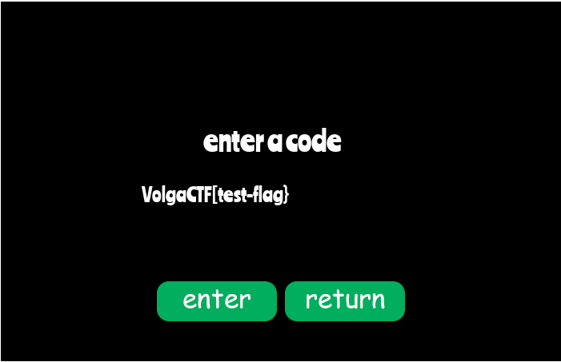

# Snake

Love to play the good old snake game from time to time. Used to have all the level codes, but now they're gone. One in particular is of interest to me - the one that lets you win effortlessly. I only recall it starts with `VolgaCTF{`...

Can you help me find that auto-win code?

http://172.105.246.119/game.html

## Solution
A browser based snake game backend in wasm.

<p align="center"></p>

<p align="center"></p>

So I dumped the big wasm file with help of developer tools and used https://webassembly.studio/ to decompile to .wat file.

## Function analysis
Randomly going through the functions I see `f277` is the largest function which takes 30 bytes and returns 1 byte, this seems to be the function that check our code. I verified it by using breakpoint in Chrome Dev Tools... the input are the code we enter in a scrambled way.
```
  (func $f277 (type $t61) (param $p0 i32) (param $p1 i32) (param $p2 i32) (param $p3 i32) (param $p4 i32) (param $p5 i32) (param $p6 i32) (param $p7 i32) (param $p8 i32) (param $p9 i32) (param $p10 i32) (param $p11 i32) (param $p12 i32) (param $p13 i32) (param $p14 i32) (param $p15 i32) (param $p16 i32) (param $p17 i32) (param $p18 i32) (param $p19 i32) (param $p20 i32) (param $p21 i32) (param $p22 i32) (param $p23 i32) (param $p24 i32) (param $p25 i32) (param $p26 i32) (param $p27 i32) (param $p28 i32) (param $p29 i32) (result i32)
```
After initialisation the function multiplies some flag bytes and adds the sum of them, at the end another constant is added and the value is passed to `$f278` along with another value(256). The function returns the modulus of the sum with 256 and after that a check is done if the modulus is zero or not... (Analysis done with help of breakpoints)
```
    i32.load8_u offset=31
    set_local $l4
    i32.const 255
    set_local $l5
    get_local $l4
    get_local $l5
    i32.and
    set_local $l6
    i32.const 81
    set_local $l7
    get_local $l6
    get_local $l7
    i32.mul
    set_local $l8
    get_local $l2
    i32.load8_u offset=30
    set_local $l9
    i32.const 255
    set_local $l10
    get_local $l9
    get_local $l10
    i32.and
    set_local $l11
    i32.const 244
    set_local $l12
    get_local $l11
    get_local $l12
    i32.mul
    set_local $l13
    get_local $l8
    get_local $l13
    i32.add
    set_local $l14
    get_local $l2
    .
    .
    .
    i32.load8_u offset=2
    set_local $l171
    i32.const 255
    set_local $l172
    get_local $l171
    get_local $l172
    i32.and
    set_local $l173
    i32.const 44
    set_local $l174
    get_local $l173
    get_local $l174
    i32.mul
    set_local $l175
    get_local $l170
    get_local $l175
    i32.add
    set_local $l176
    i32.const 168
    set_local $l177
    get_local $l176
    get_local $l177
    i32.add
    set_local $l178
    get_local $l178
    set_local $l179
    get_local $l179
    i64.extend_s/i32
    set_local $l5775
    get_local $l5775
    get_local $l5774
    call $f278
```

There are 30 other check blocks similar to this... so I parsed 18 of them (others weren't needed for the flag) the constants with regex and applied z3. Script [here](./solve.py)

<p align="center"></p>

## Flag
> VolgaCTF{2a36c601d83aaf763d1e}