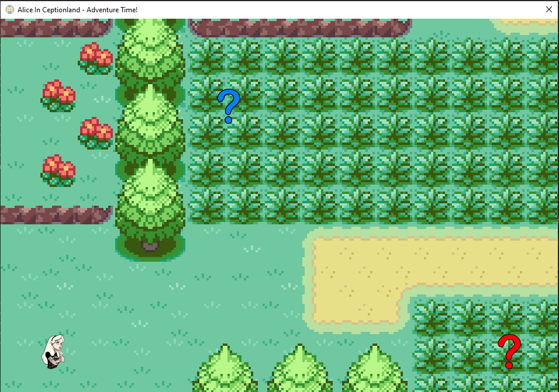
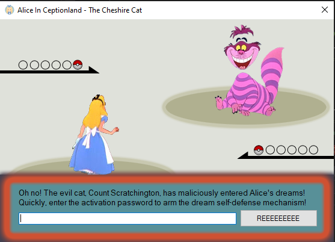
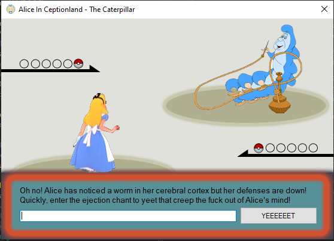
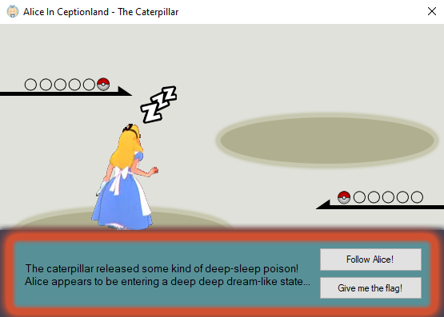
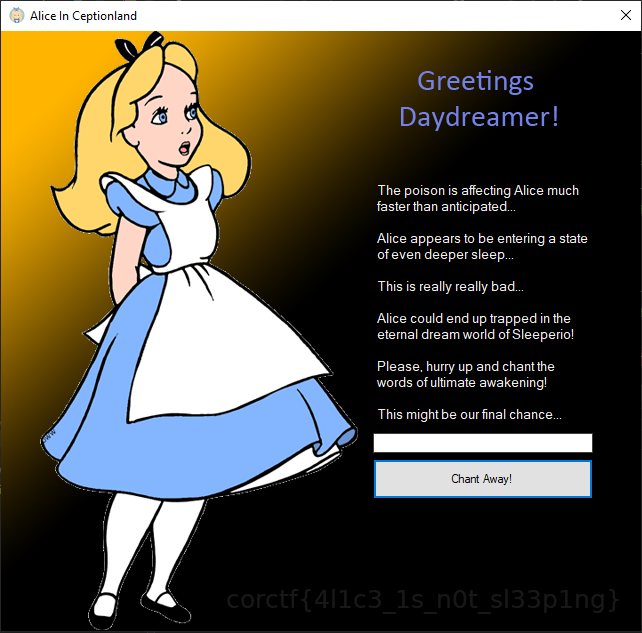
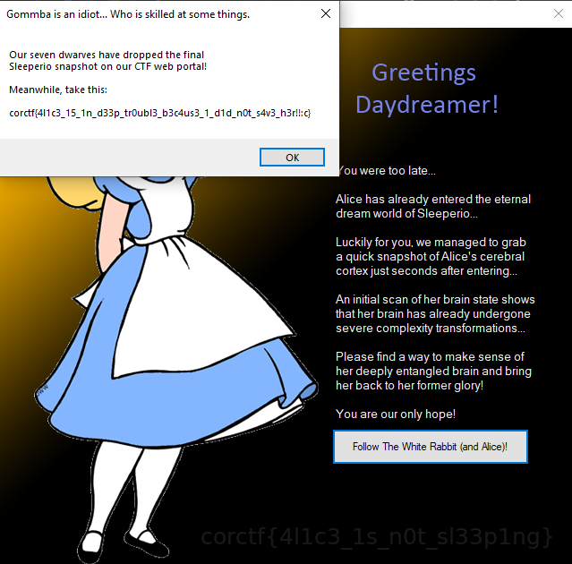

# AliceInCeptionland

Our dear beloved Alice is undergoing a cerebral attack by some of the fiercest enemies known to man. Quick, get in there and help her!

Attachments:
* [AliceInCeptionland.exe](./AliceInCeptionland.exe)

## Solution
We are given a 32-bit Mono/.Net assembly binary. Opened in dnSpy 32.

It's a small game, we can see two question marks, which are like enemies (`Caterpillar` & `CheshireCat`).

<p align="center"></p>

We need to provide a password to defeat them. The correct passwords are used as key and iv for an AES Decryption. The decrypted buffer is converted to assembly and loaded. This is used for the final part where we get flag.
```csharp
private static void Main()
{
	Application.EnableVisualStyles();
	Application.SetCompatibleTextRenderingDefault(false);
	BaseGame baseGame = new BaseGame();
	Application.Run(baseGame);
	if (!string.IsNullOrEmpty(baseGame.Foo) && !string.IsNullOrEmpty(baseGame.Bar))
	{
		byte[] iv = null;
		byte[] key = null;
		using (MD5 md = MD5.Create())
		{
			iv = md.ComputeHash(Encoding.ASCII.GetBytes(baseGame.Foo));
		}
		using (SHA256 sha = SHA256.Create())
		{
			key = sha.ComputeHash(Encoding.ASCII.GetBytes(baseGame.Bar));
		}
		using (Aes aes = Aes.Create())
		{
			aes.IV = iv;
			aes.Key = key;
			aes.Padding = PaddingMode.PKCS7;
			ICryptoTransform transform = aes.CreateDecryptor(aes.Key, aes.IV);
			using (MemoryStream memoryStream = new MemoryStream())
			{
				using (CryptoStream cryptoStream = new CryptoStream(memoryStream, transform, CryptoStreamMode.Write))
				{
					byte[] aliceInCeptiondream = Resources.AliceInCeptiondream;
					cryptoStream.Write(aliceInCeptiondream, 0, aliceInCeptiondream.Length);
					cryptoStream.FlushFinalBlock();
					Application.Run(new DeepDream(Assembly.Load(memoryStream.ToArray())));
				}
			}
		}
	}
}
```

### CheshireCat

<p align="center"></p>

```csharp
private void button1_Click(object sender, EventArgs e)
{
	string text = WhiteRabbit.Transform("41!ce1337");
	char[] array = WhiteRabbit.Transform(this.textBox1.Text).Reverse<char>().ToArray<char>();
	for (int i = 0; i < array.Length; i++)
	{
		char[] array2 = array;
		int num = i;
		array2[num] ^= text[i % text.Length];
	}
	if (string.Join<char>("", array.Reverse<char>()).Equals("oI!&}IusoKs ?Ytr"))
	{
		this.Secret = this.textBox1.Text;
		this.label1.Visible = false;
		this.textBox1.Visible = false;
		this.button1.Visible = false;
		this.timer1.Start();
	}
}
```
It is a simple xor. Key : `\xDE\xAD\xBE\xEF`

### Caterpillar

<p align="center"></p>

```csharp
private void button1_Click(object sender, EventArgs e)
{
	string text = WhiteRabbit.Transform("c4t3rp1114rz_s3cr3t1y_ru13_7h3_w0r1d");
	char[] array = WhiteRabbit.Transform(this.textBox1.Text).Reverse<char>().ToArray<char>();
	for (int i = 0; i < array.Length; i++)
	{
		byte b = Convert.ToByte(array[i]);
		b = this.rol(b, 114);
		b += 222;
		b ^= Convert.ToByte(text[i % text.Length]);
		b -= 127;
		b = this.rol(b, 6);
		array[i] = Convert.ToChar(b);
	}
	if (string.Join<char>("", array.Reverse<char>()).Equals("\0R\u009c\u007f\u0016ndC\u0005î\u0093MíÃ×\u007f\u0093\u0090\u007fS}­\u0093)ÿÃ\f0\u0093g/\u0003\u0093+ö\0Rt\u007f\u0016\u0087dC\aî\u0093píÃ8\u007f\u0093\u0093\u007fSz­\u0093ÇÿÃÓ0\u0093\u0086/\u0003q"))
	{
		this.Secret = this.textBox1.Text;
		this.label1.Visible = false;
		this.textBox1.Visible = false;
		this.button1.Visible = false;
		this.timer1.Start();
	}
}
```
The key can be easily reversible. [Script](./caterpillar.cpp). Key : `\x4\xL\x1\xC\x3\x1\xS\xN\x0\xT\x4\xS\xL\x3\x3\xP\xS\x4\xV\x3\xH\x3\xR`

<p align="center"></p>

### DeepDream
This is the last key check.

<p align="center"></p>

```csharp
private void button1_Click(object sender, EventArgs e)
{
	if (!((string)this.Dream.GetType("AliceInCeptiondream.Dream").GetMethod("Encode").Invoke(null, new object[]
	{
		this.textBox1.Text
	})).Equals("3c3cf1df89fe832aefcc22fc82017cd57bef01df54235e21414122d78a9d88cfef3cf10c829ee32ae4ef01dfa1951cd51b7b22fc82433ef7ef418cdf8a9d802101ef64f9a495268fef18d52882324f217b1bd64b82017cd57bef01df255288f7593922712c958029e7efccdf081f8808a6efd5287595f821482822f6cb95f821cceff4695495268fefe72ad7821a67ae0060ad"))
	{
		MessageBox.Show(this, "If you were to chant these words of stupidity,\nI'd imagine we would never see Alice again...\nTry another chant... Something has to work!", "Probably you are 1000 kilogram in basement.");
		return;
	}
	this.label1.Visible = false;
	this.button1.Visible = false;
	this.textBox1.Visible = false;
	this.label2.Visible = true;
	this.button2.Visible = true;
}
```
The function `Encode` is dynamically created from the buffer we decrypted. So we need to analyze them dynamically.

### Encode
```csharp
public static string Encode(string plaintext)
{
	string text = string.Empty;
	if (!string.IsNullOrEmpty(plaintext))
	{
		string text2 = string.Join("/", plaintext.Select(new Func<char, string>(Dream.<Encode>g__fm|3_3)).ToArray<string>());
		byte[] array = new byte[]
		{
			(byte)(Dream.xm & 255UL),
			(byte)(Dream.xm >> 8 & 255UL),
			(byte)(Dream.xm >> 16 & 255UL),
			(byte)(Dream.xm >> 24 & 255UL),
			(byte)(Dream.xm >> 32 & 255UL),
			(byte)(Dream.xm >> 40 & 255UL),
			(byte)(Dream.xm >> 48 & 255UL),
			(byte)(Dream.xm >> 56 & 255UL)
		};
		for (int i = 0; i < text2.Length; i++)
		{
			text += string.Format("{0:x2}", (byte)text2[i] ^ array[i % array.Length]);
		}
	}
	bool flag = false;
	if (Dream.CheckRemoteDebuggerPresent(Process.GetCurrentProcess().Handle, ref flag) && flag)
	{
		text = string.Join<char>("", text.Reverse<char>().ToArray<char>());
	}
	return text;
}

internal static char <Encode>g__fl|3_0(char c)
{
	return (char)Dream.rol((byte)c, 3);
}

internal static char <Encode>g__fr|3_1(char c)
{
	return (char)Dream.ror((byte)c, 5);
}

internal static string <Encode>g__fx|3_2(char c, string x)
{
	return new string((from y in x
	select (char)((byte)y ^ (byte)c)).ToArray<char>());
}

internal static string <Encode>g__fm|3_3(char c)
{
	return string.Join("", new string[]
	{
		Dream.<Encode>g__fx|3_2(c, new string(Dream.rm[(int)Dream.<Encode>g__fl|3_0(c)].Select(new Func<char, char>(Dream.<Encode>g__fr|3_1)).ToArray<char>()))
	});
}

internal static string <Encode>g__fm|3_3(char c)
{
	return string.Join("", new string[]
	{
		Dream.<Encode>g__fx|3_2(c, new string(Dream.rm[(int)Dream.<Encode>g__fl|3_0(c)].Select(new Func<char, char>(Dream.<Encode>g__fr|3_1)).ToArray<char>()))
	});
}
```
The constructor initializes variables `rm` and `xm`. So it creates encoded character streams seperated by `/` then xors it (0xC0, 0xC0, 0x0D, 0xF0, 0xAD, 0xBA, 0xA7, 0x0E) and converts into a hex stream. So we create a character database for all characters, and reverse search the encoded stream.

Script [here](./solve.py). Key : `Sleeperio Sleeperio Disappeario Instanterio!`

<p align="center"></p>

## Flag
>  corctf{4l1c3_15_1n_d33p_tr0ubl3_b3c4us3_1_d1d_n0t_s4v3_h3r!!:c}
