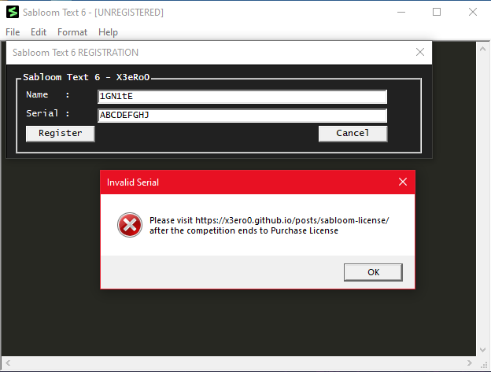

# Sabloom Text 6

Finally, we have a text editor better than notepad.

Attachments:
* [Sabloom_Text_6.exe](./Sabloom_Text_6.exe)

## Solution
- A text editor similar to Sublime Text. It has a register (Help -> Register) option, probably the flag check.

<p align="center"></p>

In the `DialogFunc` the registration is checked
```c
      GetDlgItemTextA(hDlg, 1003, Name, 100);
      GetDlgItemTextA(hDlg, 1004, Serial, 100);
      if ( check_license(Name, Serial) )
      {
        dword_4055B0 = 1;
        MessageBoxA(hDlg, "Product Registered", "Sabloom Text 6 - Registered", 0);
        SetWindowTextA(h, "Sabloom Text 6 - X3eRo0");
      }
      else
      {
        dword_4055B0 = 0;
        MessageBoxA(
          hDlg,
          "Please visit https://x3ero0.github.io/posts/sabloom-license/ after the competition ends to Purchase License",
          "Invalid Serial",
          0x10u);
      }
```

### `check_license`

This the function that checks our license.

```c
if ( strlen(name) != 6 )
    return 0;
```
- First it checks lenght of name is 6 or not.
```c
  v2 = (char *)malloc(0x37u);
  enc_serial = v2;
  v3 = malloc(0x1081u);
  buffer = v3;
  if ( !v2 || !v3 )
    return 0;
  memset(v2, 0, 0x37u);
  memset(v3, 0, 0x1081u);
  len = strlen(serial);
  v39 = (char *)&unk_403511;
  v6 = v2 + 2;
  v7 = -2 - (_DWORD)v2;
  v34 = &unk_403510 - (_UNKNOWN *)v2;
  v33 = 1 - (_DWORD)v2;
  v32 = &unk_403511 - (_UNKNOWN *)v2;
  v31 = 2 - (_DWORD)v2;
  v30 = &unk_403512 - (_UNKNOWN *)v2;
  v29 = 3 - (_DWORD)v2;
  v8 = &unk_403513 - (_UNKNOWN *)v2;
  v9 = -1 - (_DWORD)v2;
  do
  {
    *(v6 - 2) = *(v39 - 1) ^ serial[(unsigned int)&v6[v7] % len];
    v10 = v39;
    v39 += 6;
    *(v6 - 1) = *v10 ^ serial[(unsigned int)&v6[v9] % len];
    *v6 = v6[v34] ^ serial[(unsigned int)&v10[2 - (_DWORD)&unk_403511] % len];
    v6[1] = v6[v32] ^ serial[(unsigned int)&v6[v33] % len];
    v6[2] = v6[v30] ^ serial[(unsigned int)&v6[v31] % len];
    v6[3] = v6[v8] ^ serial[(unsigned int)&v6[v29] % len];
    v6 += 6;
  }
  while ( (int)&v6[v7] < 54 );
```
- Then it initializes two buffers
- It repeatedly xors our serial with a hardcoded key in a very weird way.

```c
  v11 = buffer;
  v12 = (char *)&unk_403550;
  v36 = (char *)&unk_403550;
  v37 = buffer;
  do
  {
    v13 = v12;
    v40 = 8;
    do
    {
      v14 = *v13;
      v15 = v11;
      v16 = 7;
      v28 = v11 + 8;
      do
      {
        v17 = v16;
        ++v15;
        --v16;
        *(v15 - 1) = (v14 >> v17) & 1;
      }
      while ( v16 > -1 );
      v11 = v28;
      ++v13;
      --v40;
    }
    while ( v40 );
    v12 = v36 + 9;
    v11 = v37 + 65;
    v36 = v12;
    v37 += 65;
  }
  while ( (int)v12 < (int)&unk_403799 );
  buffer[4158] = '3';
```

- Then it fills the big buffer with some calculated values
- By looking into it we can see that its a 65 x 65 maze filled with `0` & `1` and `0x33 ('3')` is the endpoint

```c
chk = sub_401C50(buffer, enc_serial) == 0;
```

- Then it passes the encrypted serial and the maze buffer to a function and check whether the output is 0 or not

```c
  if ( *name == 'X' )
    v19 = chk;
  v20 = 0;
  if ( name[1] == serial[2] )
    v20 = v19;
  v21 = 0;
  if ( name[2] == serial[9] )
    v21 = v20;
  v22 = 0;
  if ( name[3] == serial[14] )
    v22 = v21;
  v23 = 0;
  if ( name[4] == 'o' )
    v23 = v22;
  v24 = 0;
  if ( name[5] == serial[4] )
    v24 = v23;
```

- Then it checks the username

### `sub_401C50` (Run Maze)

```c
  memset(_enc_bit_serial, 0, 432u);
  v3 = 0;
  for ( i = 0; i < 54; ++i )
  {
    v5 = 0;
    v6 = enc_serial[i];
    do
    {
      v7 = 7 - v5++;
      _enc_bit_serial[v3++] = (v6 >> v7) & 1;
    }
    while ( v5 < 8 );
  }
```

- Initially it converts the encrypted serial into a binary array.

```c
v11 = _enc_bit_serial;
  arr_y = 65;
  c = 0;
  do
  {
    v14 = v11[c + 1];
    if ( v11[c] == 1 )
    {
      ++c;
      if ( v14 == 1 )
      {
        move = (move + 1) % 4;
      }
      else
      {
		move = (move - 1) % 4;
      }
    }
    ++c;
    switch ( move )
    {
      case 0:
        x = arr_x;
        v11 = enc_bit_serial;
        if ( maze[arr_y + 2 + arr_x] )
        {
          v11 = enc_bit_serial;
          if ( maze[arr_y + 1 + arr_x] )
          {
            x = arr_x + 2;
            arr_x += 2;
          }
        }
        break;
      case 1:
        x = arr_x;
        if ( maze[arr_x + 130 + arr_y] )
        {
          v11 = enc_bit_serial;
          if ( maze[arr_y + 65 + arr_x] )
          {
            y += 2;
            arr_y += 130;
          }
        }
        break;
      case 2:
        x = arr_x;
        v11 = enc_bit_serial;
        if ( maze[arr_y - 2 + arr_x] )
        {
          v11 = enc_bit_serial;
          if ( maze[arr_y - 1 + arr_x] )
          {
            x = arr_x - 2;
            arr_x -= 2;
          }
        }
        break;
      case 3:
        x = arr_x;
        v11 = enc_bit_serial;
        if ( maze[arr_x - 130 + arr_y] )
        {
          x = arr_x;
          if ( maze[arr_y - 65 + arr_x] )
          {
            y -= 2;
            arr_y -= 130;
          }
        }
        break;
      default:
        x = arr_x;
        break;
    }
  }
  while ( c != 432 );
```

- Then it parses moves from the binary and runs the moves into the maze (Every move increments the position by 2)
- No of moves is 432 (54 * 8 / 54 being length of encrypted serial)

```c
  if ( v20 || v17 || maze[64 * y + y + x] != '3' )
    result = -1;
  else
    result = 0;
```

- At end it checks the position is `'3'` or not

### Script

I extracted the maze data by dynamically debugging with `x32dbg`. Solved the maze [maze.py](./maze.py)

It gave the moves, from that I made the binary array and it to encrypted_serial. Then I xored the serial with the hardcoded key to get the flag. [solve.py](./solve.py)

## Flag
> zh3r0{mAzes_w3Re_1nv3nteD_by_EgyptianS_cb3c82b9}